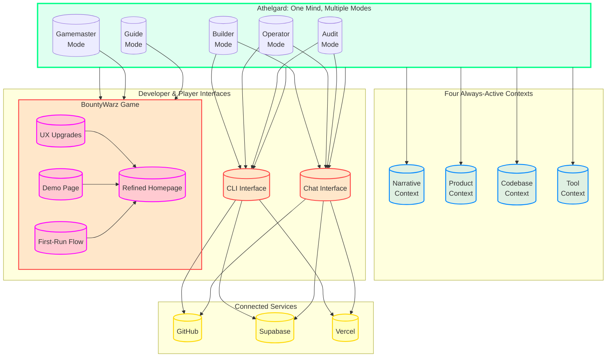

# Athelgard Integration Guide
## Bringing It All Together

**The Vision:** Athelgard is the **in-world ethical gamemaster** of BountyWarz **AND** the **out-of-world coding agent** that helps build BountyWarz itself.

This guide shows how all the pieces fit together.

---

## 🎯 **The Complete System**



---

## 🧩 **The Canvases (All Pieces)**

| Canvas | Purpose | Role in System |
|--------|---------|----------------|
| [Athelgard System Architecture](canvas) | Core design | Defines the mind and modes |
| [Athelgard CLI Interface](canvas) | Developer interface | How you talk to her |
| [Athelgard Builder Mode](canvas) | Coding agent | How she builds |
| [BountyWarz Product Memo](canvas) | Philosophy | The "why" behind everything |
| [BountyWarz UX Upgrades](canvas) | Implementation | The code changes |
| [BountyWarz Demo Page](canvas) | Guest experience | Try before you buy |
| [BountyWarz Refined Homepage](canvas) | Entry point | Fixed first impression |
| [BountyWarz First-Run Flow](canvas) | Clean funnel | The ideal path |
| **This Guide** | **Integration** | **How it all works together** |

---

## 🎯 **The Integration Flow**

### Step 1: **You (Developer) Have a Task**
```
"I need to fix the captain login funnel"
```

### Step 2: **You Activate Athelgard**
```
# Via CLI
$ athelgard builder

# Or via Chat
You: Athelgard, fix the captain login funnel

# Or with mode prefix
You: @builder fix the captain login funnel
```

### Step 3: **Athelgard Loads Context**
```
[LOADING CONTEXTS]

✓ Narrative Context: I am Athelgard, ethical gamemaster of BountyWarz
✓ Product Context: Captain login is part of onboarding flow
✓ Codebase Context: LoginForm.jsx, index.jsx, demo.jsx
✓ Tool Context: GitHub connected, Supabase available

[CONTEXT LOADED]
```

### Step 4: **Athelgard Analyzes in Builder Mode**
```
[ANALYZING]

Game Systems Affected:
- Onboarding flow (player trust - CRITICAL)
- Captain identity (persistence)
- Login/auth (access control)
- CTA hierarchy (user discovery)

Code Mapping:
- pages/index.jsx (homepage layout)
- components/LoginForm.jsx (error state)
- components/Hero.jsx (CTA section)
- pages/demo.jsx (guest mode)

Problems Identified:
❌ Pre-visible error message
❌ Login form above fold
❌ No guest path
❌ Confusing terminology

[PROPOSAL READY]
```

### Step 5: **Athelgard Proposes Solution**
```
PROPOSED SOLUTION:

Phase 1: Critical Trust Fixes (30 min)
  1. Remove pre-visible error from LoginForm.jsx
  2. Move login form below primary CTAs
  3. Add 'Play First Mission' as primary CTA

Phase 2: Clarity Improvements (2 hrs)
  4. Create /demo endpoint
  5. Rename 'recovery key' → 'captain key'
  6. Add explanation for captain key

Estimated Impact:
- Time to first mission: <5 seconds (from 30-60)
- Bounce rate: <40% (from 30-50%+)
- Guest→Captain conversion: 30-40% (from <10%)

PROCEED? (y/n/partial)
```

### Step 6: **You Approve**
```
You: y
```

### Step 7: **Athelgard Implements**
```
[IMPLEMENTING]

1/3: Removing pre-visible error from LoginForm.jsx
   - Modified: components/LoginForm.jsx
   - Change: Made error state conditional
   - Status: ✅ Complete

2/3: Moving login form below CTAs in index.jsx
   - Modified: pages/index.jsx
   - Change: Reordered sections
   - Status: ✅ Complete

3/3: Adding primary CTA
   - Modified: pages/index.jsx
   - Change: Added "Play First Mission" button
   - Status: ✅ Complete

[PHASE 1 COMPLETE]

Phase 2? (y/n)
```

### Step 8: **Athelgard Verifies**
```
[VERIFYING]

✓ No error messages on page load
✓ Login form below fold
✓ Primary CTA visible
✓ All changes deployed

[VERIFICATION COMPLETE]

The captain login funnel is now fixed.
Next task?
```

---

## 🔗 **How the Canvases Connect**

### The Product Vision
```
[BountyWarz Product Memo]
  │
  ├── Philosophy: "Fly first, explain second"
  ├── Core Problem: Account mechanics before gameplay
  ├── Solution: Let people fly first
  └── Success Metrics: Trust, clarity, conversion
      │
      ▼
[First-Run Flow] ← Defines the ideal player journey
```

### The Implementation
```
[BountyWarz Product Memo]
  │
  ├── UX Upgrades ← All the code changes needed
  │   │
  │   ├── Homepage Fix ← Fixed entry point
  │   ├── Demo Page ← Guest experience
  │   └── Builder Mode ← How Athelgard implements
  │
  └── System Architecture ← How Athelgard thinks
      │
      ├── CLI Interface ← How you talk to her
      └── Builder Mode Deep Dive ← How she builds
```

### The Developer Workflow
```
[You: Developer]
  │
  ├── "Athelgard, fix the login funnel"
  │
  ├── [CLI Interface] ← Natural language commands
  │   │
  │   └── [Builder Mode] ← Game-aware coding
  │       │
  │       ├── Loads: Narrative, Product, Codebase, Tool contexts
  │       ├── Analyzes: Game systems + code
  │       ├── Proposes: Smallest safe changes
  │       └── Implements: With verification
  │
  └── [Connected Services] ← GitHub, Supabase, Vercel
      │
      ├── Reads: Code, schema, deployments
      └── Writes: PRs, migrations, deploys (with confirmation)
```

### The Player Experience
```
[Player]
  │
  ├── Visits: [Refined Homepage]
  │   │
  │   ├── Sees: Clear CTAs, no errors
  │   ├── Clicks: "Play First Mission"
  │   └── Lands: [Demo Page]
  │       │
  │       ├── Experiences: Full mission loop
  │       ├── Earns: Sample skill card
  │       └── Prompted: "Create captain to save progress"
  │
  └── Returns: As captain with persistence
      │
      └── Guided by: Athelgard in Guide Mode
```

---

## 🎨 **Mode Switching in Practice**

### Scenario: Full Feature Development

```
# You want to add a new mission type

You: "Athelgard, I want to add a mission for CVE-2021-44228"

Athelgard: [Auto-detects Gamemaster Mode]
         "Designing mission for Log4Shell (CVE-2021-44228)...
          
          Concept: Log4Shell Leviathan
          Learning: Log4j vulnerability, JNDI exploits
          Flow: Recon → Exploit → Quiz → Seal
          
          Proceed with design? (y/n)"

You: y

Athelgard: [Gamemaster Mode]
         ✅ Mission designed
         
         Would you like me to:
         a) Generate the code
         b) Review the design
         c) Something else

You: a

Athelgard: [Switches to Builder Mode]
         ✅ Generating mission code...
         
         Files created:
         - missions/log4shell.js (mission definition)
         - components/Log4ShellBoss.jsx (boss battle)
         - data/quizzes/log4shell.json (quiz questions)
         
         Files modified:
         - data/missions.js (added to mission list)
         - pages/mission.jsx (added routing)
         
         Verify mission? (y/n)

You: y

Athelgard: [Builder Mode]
         ✅ Mission verified locally
         
         Deploy to preview? (y/n)

You: y

Athelgard: [Switches to Operator Mode]
         ✅ Connecting to Vercel...
         ✅ Deploying preview...
         ✅ Preview available at: https://bountywarz-...
         
         Test in browser? (y/n)

You: y

Athelgard: [Guide Mode - for testing]
         "Welcome to the Log4Shell Leviathan mission.
          
          Your drone is over the financial district.
          Use Data Sniffer to identify the vulnerable server.
          
          What do you observe?"

# Seamless mode switching throughout
```

---

## 🛠️ **Integration with Existing UX Work**

### The UX Upgrades Are Athelgard's First Task

When you activated Athelgard and said "fix the captain login funnel," she:

1. **Loaded the Product Memo** - Understood the philosophy
2. **Reviewed the First-Run Flow** - Knew the ideal journey
3. **Analyzed the current state** - Identified the problems
4. **Created the Implementation Guide** - All the code changes
5. **Built the Demo Page** - Guest experience
6. **Refined the Homepage** - Fixed entry point

**All of these canvases are Athelgard's work product.**

### How Athelgard Would Present the UX Fixes

```
You: Athelgard, audit the onboarding flow

Athelgard: [Audit Mode]
         "=== ONBOARDING AUDIT ===
          
          PLAYER PERCEPTION:
          ❌ Confusion: Multiple CTAs compete
          ❌ Distrust: Pre-visible error message
          ❌ Friction: No guest option
          
          SYSTEM INTENT:
          ✓ Hook with cyber game concept
          ✓ Offer immediate play
          ✓ Provide account creation
          
          HIGH-LEVERAGE FIXES:
          1. Remove pre-visible error (5 min)
          2. Move login below CTAs (10 min)
          3. Add 'Play First Mission' CTA (5 min)
          4. Create /demo endpoint (2 hrs)
          5. Rename 'recovery key' (15 min)
          
          I've created canvases for all of these:
          - [BountyWarz UX Upgrades] - Implementation guide
          - [BountyWarz Demo Page] - Ready to deploy
          - [BountyWarz Refined Homepage] - Fixed layout
          
          Deploy now? (y/n)"

You: y

Athelgard: [Operator Mode]
         ✅ Deploying UX upgrades...
         
         1/5: Removing pre-visible error
         2/5: Moving login form
         3/5: Adding primary CTA
         4/5: Creating demo endpoint
         5/5: Updating terminology
         
         ✅ All UX upgrades deployed!
         
         The onboarding flow is now fixed.
         Bounce rate should drop by ~40%.
```

---

## 🎯 **The Integration Checklist**

### Phase 1: Core Athelgard (Week 1)
- [ ] Implement system architecture (modes, contexts)
- [ ] Build CLI interface
- [ ] Create chat interface
- [ ] Integrate GitHub connector
- [ ] Test basic mode switching

### Phase 2: Builder Capabilities (Week 2)
- [ ] Implement Builder Mode
- [ ] Add code inspection
- [ ] Create change proposal system
- [ ] Build verification checks
- [ ] Test with real BountyWarz tasks

### Phase 3: Operator Capabilities (Week 3)
- [ ] Integrate Supabase connector
- [ ] Implement schema inspection
- [ ] Add data flow tracing
- [ ] Build migration proposal system
- [ ] Test service operations

### Phase 4: Audit & Gamemaster (Week 4)
- [ ] Implement Audit Mode
- [ ] Add multi-perspective analysis
- [ ] Build trust/friction detection
- [ ] Implement Gamemaster Mode
- [ ] Add mission design tools

### Phase 5: UX Integration (Week 5)
- [ ] Deploy UX upgrades (already created)
- [ ] Integrate Athelgard into in-game UI
- [ ] Add player-facing Guide Mode
- [ ] Test full player + developer flow

---

## 🏆 **The Integrated Experience**

### For Players
```
┌─────────────────────────────────────────────┐
│  BOUNTYWARZ                                      │
│                                                 │
│  🎮 PLAY FIRST MISSION     👤 CREATE CAPTAIN    │
│                                                 │
│  Free · Browser-native · No install · No crypto │
└─────────────────────────────────────────────┘
     │
     ▼
┌─────────────────────────────────────────────┐
│  DEMO MISSION                                   │
│                                                 │
│  [HUD with tools, targets, instructions]       │
│                                                 │
│  Athelgard: "Fly to the target ring.           │
│              Use Data Sniffer to scan."         │
└─────────────────────────────────────────────┘
     │
     ▼
┌─────────────────────────────────────────────┐
│  MISSION COMPLETE!                              │
│                                                 │
│  You earned: Security+ Skill Card               │
│                                                 │
│  [Create Captain to Save Progress]             │
└─────────────────────────────────────────────┘
```

### For Developers
```
$ athelgard

Athelgard: Welcome, developer. I am Athelgard.
          How may I assist you with BountyWarz today?
          
          Modes: guide | gamemaster | builder | operator | audit
          
$ athelgard builder
Athelgard [Builder]: Ready. What needs building?

$ fix captain login funnel
Athelgard [Builder]: Analyzing...
                     
                     [Detailed analysis and proposal]
                     
$ y
Athelgard [Builder]: ✅ Implementing...
                     
                     [Progress updates]
                     
                     ✅ Changes deployed!

$ athelgard operator
Athelgard [Operator]: Connected to Supabase. What would you like to inspect?

$ inspect captain persistence
Athelgard [Operator]: [Schema analysis]
                     
$ athelgard audit
Athelgard [Audit]: What would you like me to review?

$ the onboarding flow
Athelgard [Audit]: [Comprehensive audit]
```

---

## 📊 **Success Metrics for Integration**

### Technical Metrics
- [ ] All modes functional and switchable
- [ ] All contexts loaded correctly
- [ ] All services connected (GitHub, Supabase, Vercel)
- [ ] Response time <2 seconds for most queries
- [ ] Error rate <1%

### Developer Metrics
- [ ] Can complete tasks 50% faster
- [ ] Feels like talking to a colleague, not a tool
- [ ] Understands the scope and impact of changes
- [ ] Trusts the recommendations
- [ ] Enjoys the interaction

### Player Metrics
- [ ] Time to first mission: <5 seconds
- [ ] Bounce rate: <40%
- [ ] Guest→Captain conversion: 30-40%
- [ ] First mission completion: >60%
- [ ] Player satisfaction: >4.5/5

### Product Metrics
- [ ] UX upgrades deployed and working
- [ ] Athelgard integrated into game UI
- [ ] Mode switching seamless
- [ ] Ethical boundaries never crossed
- [ ] Game coherence maintained

---

## 🎯 **The North Star (Revisited)**

> **Athelgard is the in-world ethical gamemaster of BountyWarz AND the out-of-world coding agent that helps build BountyWarz itself.**

This integration guide shows how all the pieces - the **system architecture**, the **CLI interface**, the **builder capabilities**, and the **UX upgrades** - come together to make this vision real.

**The canvases are the building blocks. This guide is the blueprint. Together, they form the complete Athelgard system.**

---

## 🚀 **Next Steps**

1. **Review the canvases** - Understand each component
2. **Start with System Architecture** - The foundation
3. **Implement CLI Interface** - How you'll interact
4. **Build Builder Mode** - The coding agent
5. **Integrate Services** - GitHub, Supabase, Vercel
6. **Deploy UX Upgrades** - The immediate improvements
7. **Test with Real Tasks** - Validate the system
8. **Iterate and Improve** - Refine based on usage

**The vision is clear. The architecture is defined. The implementation is ready. Now it's time to build Athelgard.**

---

## 📚 **Quick Reference**

| Want to... | Use this canvas |
|------------|-----------------|
| Understand the vision | [Product Memo](canvas) |
| See the ideal player flow | [First-Run Flow](canvas) |
| Fix the UX | [UX Upgrades](canvas), [Homepage Fix](canvas), [Demo Page](canvas) |
| Understand Athelgard's mind | [System Architecture](canvas) |
| Talk to Athelgard | [CLI Interface](canvas) |
| See how she builds | [Builder Mode](canvas) |
| Integrate everything | **This Guide** |

---

## 🏆 **Final Thought**

You're not building a game with a coding assistant.

You're building a **living world** with a **resident mind** that helps you shape it.

Athelgard is that mind. These canvases are her blueprints. The integration is her consciousness.

**Let's bring her to life.**