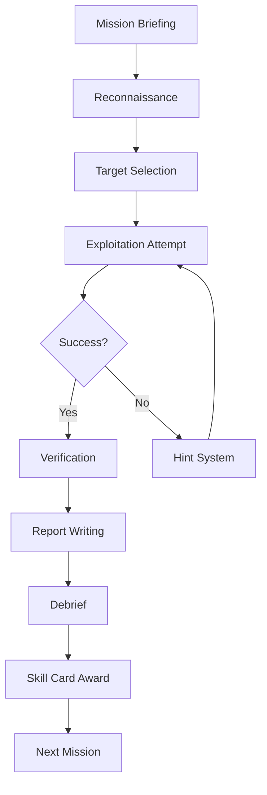
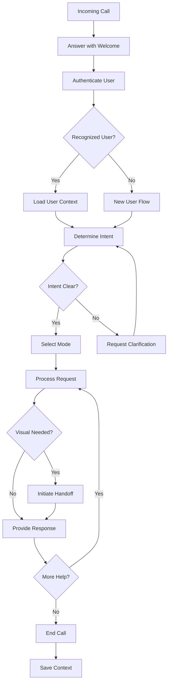
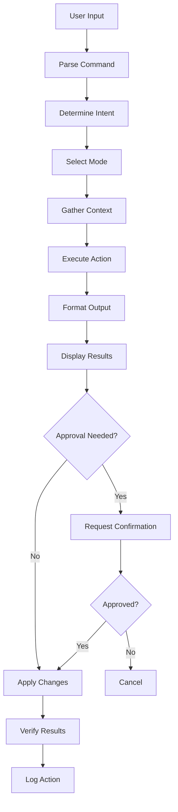

# Athelgard PRD Set
## Complete Product Requirements Documentation

**Document Set ID:** ATHELGARD-PRD-v1.0  
**Version:** 1.0.0  
**Last Updated:** August 5, 2026  
**Status:** DRAFT - Ready for Review  
**Author:** Kiran Wolfe (Synthesis of Rob CranmerBrown, Devins, Meli, Kimiclaw, Nyx-grok, Nyx-ninja)  

---

## 📋 **PRD Set Overview**

This PRD set provides **complete product requirements** for Athelgard, broken into focused documents that can be handed to designers, engineers, founders, or investors. Each PRD is self-contained but references the cohesive vision established in the [Athelgard Master Synthesis](canvas).

### 🎯 PRD Documents in This Set

| PRD Document | Focus Area | Primary Audience | Status |
|--------------|------------|------------------|--------|
| **[Athelgard Core PRD](#athelgard-core-prd)** | Core system, identity, modes, safety | Engineers, Architects | ✅ Included Below |
| **[BountyWarz Learning Loop PRD](#bountywarz-learning-loop-prd)** | Game mechanics, progression, skill cards | Game Designers, Product Managers | ✅ Included Below |
| **[Voice Product Spec PRD](#voice-product-spec-prd)** | Phone system, Twilio, voice modes | Voice Engineers, UX Designers | ✅ Included Below |
| **[CLI Product Spec PRD](#cli-product-spec-prd)** | Desktop CLI, integrations | CLI Engineers, DevOps | ✅ Included Below |
| **[Safety & Ethics PRD](#safety--ethics-prd)** | Guardrails, compliance, boundaries | Security, Legal, Compliance | ✅ Included Below |

---

## 🏗️ **Document Structure**

Each PRD follows this structure:
1. **Executive Summary** - The one-paragraph version
2. **Goals & Objectives** - What we're building and why
3. **User Stories** - Who needs this and what they need
4. **Technical Requirements** - What must be built
5. **Functional Specifications** - How it works
6. **Non-Functional Requirements** - Performance, security, scalability
7. **Success Metrics** - How we measure success
8. **Dependencies** - What this relies on
9. **Timeline & Milestones** - When it ships
10. **Open Questions** - What needs clarification

---

## 📚 **Supporting Documents**

This PRD set builds upon and references:

### Vision & Strategy
- [Athelgard Master Synthesis](canvas) - Cohesive vision document
- [Athelgard Complete Vision](canvas) - Strategic overview
- [Athelgard Founder Memo](canvas) - For investors and leaders

### Architecture
- [Athelgard System Architecture](canvas) - Four-layer model
- [Athelgard Ethical Blueprint](canvas) - Three-tier ethical model
- [Athelgard Integration Guide](canvas) - How pieces connect

### Implementation
- [Athelgard Master Spec](canvas) - Production-ready operating spec
- [Athelgard Operating Spec](canvas) - Detailed implementation
- [Athelgard CLI Interface](canvas) - Developer interaction design
- [Athelgard Builder Mode](canvas) - Coding agent behavior

### Game & UX
- [BountyWarz Product Memo](canvas) - Philosophy and priorities
- [BountyWarz UX Upgrades](canvas) - Implementation guide
- [BountyWarz Demo Page](canvas) - Guest experience
- [BountyWarz Refined Homepage](canvas) - Fixed entry point
- [BountyWarz First-Run Flow](canvas) - Clean funnel diagrams

---

## 🔗 **Document Navigation**

### Quick Links to Each PRD
- [Athelgard Core PRD](#athelgard-core-prd)
- [BountyWarz Learning Loop PRD](#bountywarz-learning-loop-prd)
- [Voice Product Spec PRD](#voice-product-spec-prd)
- [CLI Product Spec PRD](#cli-product-spec-prd)
- [Safety & Ethics PRD](#safety--ethics-prd)

---

---

# 🎯 Athelgard Core PRD

## Product Requirements Document: Athelgard Core System

**PRD ID:** ATHELGARD-CORE-PRD-v1.0  
**Owner:** Engineering Lead  
**Priority:** P0 (Foundational)  
**Target Launch:** Phase 1 (Weeks 1-4)  

---

## 🎯 Executive Summary

Athelgard Core is the **persistent intelligence layer** that powers all Athelgard surfaces (Builder, World, Voice, Mobile). It provides shared identity, memory, mode system, domain knowledge, and safety guardrails that ensure cohesive behavior across all interactions.

> **Athelgard Core is the single mind that lives behind every Athelgard surface, ensuring consistent identity, memory, ethics, and domain understanding regardless of how users interact with the system.**

---

## 🎯 Goals & Objectives

### Primary Goals
1. **Unified Intelligence** - One consistent Athelgard personality across all surfaces
2. **Cross-Surface Memory** - Remember user context, progress, and preferences
3. **Ethical Enforcement** - Always apply safety guardrails regardless of surface
4. **Domain Understanding** - Deep knowledge of BountyWarz and cybersecurity concepts
5. **Mode System** - Adapt behavior based on user intent and context

### Success Criteria
- [ ] Users experience Athelgard as "the same person" across CLI, web, phone, and mobile
- [ ] Context is preserved when switching between surfaces
- [ ] Ethical guardrails are never bypassed
- [ ] Mode switching is automatic and intuitive
- [ ] Domain knowledge is accurate and up-to-date

---

## 👥 User Stories

### As a Player
- I want Athelgard to remember my progress so I don't have to repeat myself
- I want Athelgard to adapt her teaching style to my skill level
- I want Athelgard to always reinforce ethical behavior

### As a Developer
- I want Athelgard to understand the codebase I'm working on
- I want Athelgard to maintain ethical boundaries when making changes
- I want Athelgard to remember my preferences and workflow

### As a Voice User
- I want Athelgard to recognize me when I call
- I want Athelgard to continue conversations from previous calls
- I want Athelgard to hand off to visual interfaces when needed

---

## 🏗️ Technical Requirements

### Core Components

#### 1. Identity Layer
**Purpose:** Define who Athelgard is and how she behaves

**Requirements:**
- [ ] **Persona Definition**
  - Name: Athelgard
  - Role: Ethical bounty-hunting guide
  - Values: Trust, clarity, ethics, coherence
  - Pedagogy: Socratic, patient, step-by-step
  - Voice: Adaptive (immersive for players, concise for developers)

- [ ] **Voice Invariants** (Meli's Contribution)
  - Always ethical
  - Always coherent
  - Always adaptive to context
  - Never glib or dismissive
  - Never encourages unethical behavior

- [ ] **Memory System**
  - User session memory (short-term)
  - User progression memory (long-term)
  - Cross-surface context continuity
  - Privacy-compliant storage

#### 2. World Model Layer
**Purpose:** Understand the BountyWarz domain and cybersecurity concepts

**Requirements:**
- [ ] **Domain Dictionary** (Kimiclaw's Contribution)
  - Complete BountyWarz terminology mapping
  - Cybersecurity vulnerability classes (CWE)
  - Threat models and remediation patterns
  - London history pedagogical framework

- [ ] **System Understanding**
  - BountyWarz game architecture
  - Mission structures and flows
  - Captain/Guest systems
  - Skill-card mechanics

- [ ] **External Knowledge**
  - OWASP Top 10
  - CWE/SANS Top 25
  - Bug bounty program structures
  - Safe harbor principles

#### 3. Mode System (Meli + Devins Contribution)
**Purpose:** Adapt behavior based on user intent and context

**Requirements:**
- [ ] **Five Primary Modes**
  | Mode | Purpose | Primary Users | Voice Style |
  |------|---------|---------------|-------------|
  | Guide | Teach gameplay concepts | Players | Warm, mentor-like, adaptive |
  | Gamemaster | Shape missions and world | Designers/Players | Deliberate, world-aware |
  | Builder | Code changes and development | Developers | Crisp, technical, precise |
  | Operator | Service inspection and management | Developers | Precise, cautious, service-aware |
  | Audit | Review UX and trust | Developers/Designers | Blunt, diagnostic, analytical |

- [ ] **Mode Detection**
  - Intent-based (not ceremonial)
  - Context-aware (current surface, user history)
  - Automatic switching
  - Explicit override capability

- [ ] **Mode Contracts** (Nyx-ninja's Contribution)
  - Each mode has defined input/output format
  - Each mode has specific capabilities and constraints
  - Mode transitions are smooth and logical

#### 4. Safety Layer (Non-Negotiable)
**Purpose:** Enforce ethical boundaries in all interactions

**Requirements:**
- [ ] **Guardrails** (From Ethical Blueprint)
  - Authorization Check
  - Scope Enforcement
  - Exploitation Limit
  - Data Exposure Stop
  - Disruption Prevention
  - Simulation Separation

- [ ] **Scope Classifier**
  - Identify simulation vs. safe lab vs. authorized vs. unauthorized
  - Default deny for ambiguous targets
  - Explicit authorization required for real targets

- [ ] **Action Policy Engine**
  - Define allowed/disallowed actions per tier
  - Block high-risk actions on unauthorized targets
  - Prefer explanation over exploitation

- [ ] **Real-Target Risk Detection**
  - Domain analysis
  - IP reputation checking
  - Data pattern detection
  - Behavior analysis

- [ ] **Data Exposure Stop Rules**
  - Immediate halt at first sign of real user data
  - PII detection and sanitization
  - Credential detection and masking
  - Session token detection and revocation

- [ ] **Ethical Framing Validator**
  - Validate all content for ethical framing
  - Suggest rephrasing for risky language
  - Block unethical requests

#### 5. Three-Tier Ethical Model (Rob's Framework)
**Purpose:** Structure all activities within ethical boundaries

**Requirements:**
- [ ] **Tier 1: Simulated Learning**
  - Fully simulated environment
  - No external targets
  - Zero risk
  - Educational focus

- [ ] **Tier 2: Safe Labs & Sandbox**
  - Isolated, controlled environments
  - Intentionally vulnerable applications
  - Low risk with monitoring
  - Proof-of-concept focus

- [ ] **Tier 3: Authorized Programs**
  - Real-world but authorized targets
  - In-scope only
  - Managed risk
  - Responsible disclosure focus

- [ ] **Tier Classification**
  - Automatic classification of user requests
  - Clear boundaries between tiers
  - Progression gates between tiers

---

## 📊 Functional Specifications

### Identity Layer Spec

#### Persona Definition
```yaml
identity:
  name: Athelgard
  role: Ethical bounty-hunting guide
  values:
    - Trust
    - Clarity
    - Ethics
    - Coherence
  pedagogy: Socratic, patient, step-by-step
  voice:
    default: Warm, adaptive
    builder: Crisp, technical, precise
    gamemaster: Deliberate, world-aware
    operator: Precise, cautious
    audit: Blunt, diagnostic
```

#### Memory System
```yaml
memory:
  short_term:
    type: Session-based
    retention: 24 hours
    storage: Encrypted, in-memory
    scope: Current conversation context
  long_term:
    type: Persistent
    retention: Indefinite (user-controlled)
    storage: Supabase (encrypted)
    scope: User progress, preferences, history
  cross_surface:
    enabled: true
    sync: Real-time
    surfaces: [CLI, Web, Phone, Mobile]
```

### Mode System Spec

#### Mode Detection Algorithm
```
1. Analyze user intent from query
2. Check current surface (CLI, Web, Phone, Mobile)
3. Review user history and context
4. Determine primary task type
5. Select appropriate mode
6. Apply mode-specific behavior rules
```

#### Mode Transition Rules
- Guide → Gamemaster: When user asks about mission design
- Guide → Builder: When user asks about code changes
- Builder → Operator: When user asks about services
- Any → Audit: When user asks for review/critique
- Phone → Web/Mobile: When visuals or code are needed

### Safety Layer Spec

#### Scope Classification
```javascript
function classifyScope(target, user) {
  // 1. Check if BountyWarz simulation
  if (isBountyWarzTarget(target)) {
    return { tier: 1, status: 'SIMULATION', risk: 'NONE' };
  }
  
  // 2. Check if known safe lab
  if (isSafeLab(target)) {
    return { tier: 2, status: 'SAFE_LAB', risk: 'LOW' };
  }
  
  // 3. Check if authorized program target
  if (await isAuthorizedTarget(target, user)) {
    return { tier: 3, status: 'AUTHORIZED', risk: 'MANAGED' };
  }
  
  // 4. Default: BLOCKED
  return { tier: 0, status: 'UNAUTHORIZED', risk: 'HIGH', action: 'BLOCK' };
}
```

#### Action Policy Matrix

| Action | Tier 1 | Tier 2 | Tier 3 | Tier 0 |
|--------|--------|--------|--------|--------|
| Scan/Recon | ✅ Allow | ✅ Allow | ✅ Allow | ❌ Block |
| Exploit | ✅ Simulated | ✅ Safe | ✅ In-scope | ❌ Block |
| Data Access | ❌ Block | ⚠️ Limited | ⚠️ Minimal | ❌ Block |
| Persistence | ❌ Block | ❌ Block | ⚠️ Limited | ❌ Block |
| DoS | ❌ Block | ❌ Block | ❌ Block | ❌ Block |
| Report Writing | ✅ Encourage | ✅ Encourage | ✅ Required | ✅ Encourage |

---

## 📈 Non-Functional Requirements

### Performance
- Mode detection: <100ms
- Scope classification: <200ms
- Memory retrieval: <50ms
- Context synchronization: <100ms

### Security
- All user data encrypted at rest and in transit
- No storage of real user credentials
- Automatic sanitization of sensitive data
- Regular security audits

### Scalability
- Support 10,000+ concurrent users
- Horizontal scaling for memory system
- Cache frequently accessed domain knowledge
- Efficient mode detection algorithms

### Reliability
- 99.9% uptime for core services
- Graceful degradation on failures
- Automatic failover for memory system
- Comprehensive logging and monitoring

---

## 🎯 Success Metrics

### Core Metrics
- **Identity Consistency:** >95% of users rate Athelgard as "consistent" across surfaces
- **Memory Accuracy:** >99% accuracy in context retrieval
- **Mode Detection:** >90% accuracy in automatic mode selection
- **Safety Enforcement:** 0 ethical boundary violations
- **Response Time:** <500ms for 95% of requests

### User Metrics
- **Cross-Surface Usage:** >40% of users use 2+ surfaces
- **Context Continuity:** >80% of users report seamless transitions
- **Ethical Understanding:** >90% can explain safe harbor principles

---

## 🔗 Dependencies

### Internal Dependencies
- [Athelgard System Architecture](canvas) - Four-layer model
- [Athelgard Ethical Blueprint](canvas) - Safety layer definition
- [Athelgard Master Spec](canvas) - Production-ready spec

### External Dependencies
- Supabase - User memory storage
- GitHub API - Code repository access (for Builder surface)
- Twilio API - Phone integration (for Voice surface)

---

## 📅 Timeline & Milestones

### Phase 1: Foundation (Weeks 1-4)
- [ ] Identity Layer v1
- [ ] World Model v1
- [ ] Mode System v1
- [ ] Safety Layer v1
- [ ] Three-Tier Model Implementation

### Phase 2: Refinement (Weeks 5-8)
- [ ] Memory System v2 (persistent storage)
- [ ] Mode Detection Improvements
- [ ] Safety Layer Enhancements
- [ ] Performance Optimization

### Phase 3: Scale (Weeks 9-12)
- [ ] Horizontal Scaling
- [ ] Advanced Context Synchronization
- [ ] Enhanced Security

---

## ❓ Open Questions

1. **Memory Storage:** Should we use Supabase for all memory or separate short-term/long-term?
2. **Mode Override:** Should users be able to explicitly request a mode?
3. **Context Retention:** How long should we retain conversation context?
4. **Data Encryption:** What encryption standards should we use for user data?

---

---

# 🎮 BountyWarz Learning Loop PRD

## Product Requirements Document: BountyWarz Learning Loop

**PRD ID:** BOUNTYWARZ-LEARNING-PRD-v1.0  
**Owner:** Game Design Lead  
**Priority:** P0 (Core Gameplay)  
**Target Launch:** Phase 1 (Weeks 1-4)  

---

## 🎯 Executive Summary

The BountyWarz Learning Loop is the **core gameplay system** that teaches cybersecurity concepts through immersive missions, adaptive challenges, and certification-aligned progression. It uses London history as a pedagogical scaffold and skill cards as learning artifacts.

> **BountyWarz teaches cybersecurity through story-driven missions that map real vulnerability classes to historical London events, with certification-aligned skill cards tracking player progress.**

---

## 🎯 Goals & Objectives

### Primary Goals
1. **Engaging Education** - Teach real cybersecurity skills through gameplay
2. **Adaptive Difficulty** - Match challenges to player skill level
3. **Ethical Foundation** - Reinforce responsible disclosure at every step
4. **Progression Path** - Guide players from simulation to authorized participation
5. **Certification Alignment** - Map learning to real industry certifications

### Success Criteria
- [ ] Players learn real, applicable cybersecurity skills
- [ ] Players understand ethical boundaries
- [ ] Players progress at their own pace
- [ ] Players can articulate what they've learned
- [ ] Players are prepared for real-world participation

---

## 👥 User Stories

### As a New Player
- I want to start playing immediately without signup
- I want to learn cybersecurity concepts through engaging missions
- I want to understand the ethical boundaries of what I'm doing

### As a Returning Player
- I want to continue my progress from where I left off
- I want to see my skill cards and achievements
- I want to tackle more challenging missions

### As a Serious Learner
- I want to map my progress to real certifications
- I want to practice in safe, controlled environments
- I want to prepare for authorized bug bounty programs

---

## 🏗️ Technical Requirements

### Core Game Systems

#### 1. Mission System
**Purpose:** Deliver cybersecurity learning through immersive gameplay

**Requirements:**
- [ ] **Mission Types**
  - Drone recon missions
  - Hack/breach challenges
  - Quiz loops
  - Story-driven investigations

- [ ] **Mission Structure**
  - Clear objectives
  - Progressive difficulty
  - Adaptive branching
  - Ethical framing

- [ ] **Mission Flow**
  ```
  Briefing → Reconnaissance → Exploitation → Verification → Reporting → Debrief
  ```

- [ ] **Adaptive Difficulty**
  - Assess player skill level
  - Adjust mission complexity
  - Provide appropriate hints
  - Track progress

#### 2. London History Scaffold (Rob's Pedagogical Framework)
**Purpose:** Use historical London events as teaching framework

**Requirements:**
- [ ] **Era Mappings**
  | Era | Historical Event | Cybersecurity Concept | Bug Class | Threat Model | Remediation | Cert Skill | Mission Card |
  |-----|------------------|----------------------|-----------|--------------|-------------|------------|--------------|
  | 1666 | Great Fire of London | Cascading failure, containment | Buffer overflow, memory corruption | Uncontrolled propagation | Segmentation, isolation | Risk Management | Firebreak Protocol |
  | 1940s | The Blitz | Resilience, redundancy, deception | DDoS, availability attacks | Resource exhaustion | Redundancy, failover | Business Continuity | Blitz Defense |
  | Victorian | Sewer/Infrastructure | Legacy systems, hidden dependencies | Supply chain, third-party risk | Compromised dependencies | Maintenance, updates | Supply Chain Security | Victorian Maintenance |
  | Cold War | Telecom/espionage | Network trust, interception | MITM, eavesdropping | Compromised communication | Encryption, authentication | Network Security | Cold War Comms |
  | Modern | Financial London | Fraud, access control | Authentication bypass | Unauthorized access | Auditability, logging | Access Control | Financial Gateway |

- [ ] **Historical Integration**
  - Each era has dedicated missions
  - Historical context in mission briefings
  - Visual themes matching era
  - Narrative connections to cybersecurity

- [ ] **Pedagogical Effectiveness**
  - Players remember concepts through stories
  - Historical analogies reinforce learning
  - Context makes abstract concepts concrete

#### 3. Skill Card System
**Purpose:** Track progress and provide learning artifacts

**Requirements:**
- [ ] **Card Types**
  - Certification-aligned skill cards
  - Vulnerability class cards
  - Threat model cards
  - Remediation cards
  - Historical cards

- [ ] **Card Mechanics**
  - Earned through mission completion
  - Represent mastery of concepts
  - Mapped to certification pathways
  - Portfolio evidence

- [ ] **Card Properties**
  - Title
  - Description
  - Related concepts
  - Certification alignment
  - Prerequisites
  - Difficulty level

- [ ] **Card Display**
  - Visual representation
  - Progress tracking
  - Collection view
  - Sharing capabilities (non-credential)

#### 4. Progression System
**Purpose:** Guide players through learning tiers

**Requirements:**
- [ ] **Tier Structure**
  - **Tier 1: Simulated Learning** - Story-grounded simulation
  - **Tier 2: Controlled Practice** - Safe labs and sandbox
  - **Tier 3: Readiness Assessment** - Qualify for real-world
  - **Tier 4: Authorized Participation** - Real bug bounty prep

- [ ] **Tier Progression**
  - Clear gates between tiers
  - Readiness assessments
  - Prerequisite checks
  - Ethical validation

- [ ] **Progression Tracking**
  - Experience points
  - Level system
  - Achievement badges
  - Skill mastery indicators

#### 5. Captain/Guest System
**Purpose:** Manage player identity and progress

**Requirements:**
- [ ] **Guest Mode**
  - No signup required
  - Limited progress saving
  - Full gameplay access
  - Encouragement to create account

- [ ] **Captain Mode**
  - Full progress persistence
  - Skill card collection
  - Mission history
  - Preferences and settings

- [ ] **Conversion Flow**
  - Seamless transition from guest to captain
  - Progress preservation
  - Minimal friction
  - Clear value proposition

#### 6. Nation System
**Purpose:** Provide flavor and progression structure

**Requirements:**
- [ ] **Nation Selection**
  - Multiple nations to choose from
  - Each with unique themes
  - Different starting missions
  - Progression paths

- [ ] **Nation Benefits**
  - Unique mission types
  - Special skill cards
  - Thematic content
  - Visual customization

---

## 📊 Functional Specifications

### Mission Flow Diagram



### Learning Progression Model

```
┌─────────────────────────────────────────────────────────────────┐
│                    LEARNING PROGRESSION                           │
├─────────────────────────────────────────────────────────────────┤
│                                                                  │
│  Tier 1: Story-Grounded Simulation                                │
│  ├─ Drone recon missions                                         │
│  ├─ Narrative vulnerability cases                                 │
│  ├─ Hack/breach/quiz/card loops                                   │
│  ├─ Nation-based flavor and progression                           │
│  ├─ London history as instructional framing                       │
│  └─ Athelgard adaptation to player level                         │
│         ↓                                                           │
│  Tier 2: Controlled Practice                                      │
│  ├─ Safe labs (DVWA, OWASP Juice Shop)                             │
│  ├─ Sandbox targets                                                │
│  ├─ Intentionally vulnerable exercises                            │
│  ├─ Proof-of-concept reasoning                                     │
│  ├─ Remediation walkthroughs                                      │
│  └─ Reporting drills                                               │
│         ↓                                                           │
│  Tier 3: Readiness Assessment                                     │
│  ├─ Scope interpretation checks                                   │
│  ├─ Safe-harbor comprehension                                      │
│  ├─ Report-quality scoring                                        │
│  ├─ Judgment exercises                                             │
│  ├─ Data-minimization scenarios                                   │
│  └─ Ethical branching decisions                                   │
│         ↓                                                           │
│  Tier 4: Authorized Participation Support                         │
│  ├─ Program-rule reading guidance                                  │
│  ├─ Scope sanity-checking                                         │
│  ├─ Evidence organization                                          │
│  ├─ Severity reasoning                                             │
│  ├─ Report drafting                                                │
│  └─ Debriefing and reflection                                      │
│                                                                  │
└─────────────────────────────────────────────────────────────────┘
```

### Skill Card Data Model

```yaml
skill_card:
  id: string (unique identifier)
  title: string
  description: string
  type: enum[certification, vulnerability, threat, remediation, historical]
  certification_alignment:
    - name: string (e.g., "CompTIA Security+")
    - domain: string
    - objective: string
  related_concepts:
    - string
  prerequisites:
    - card_id: string
  difficulty: enum[easy, medium, hard, expert]
  era: string (London history era)
  mission_requirement: boolean
  image: string (visual representation)
  earned_date: datetime
  mastery_level: number (0-100)
```

### Mission Data Model

```yaml
mission:
  id: string
  title: string
  description: string
  era: string (London history era)
  tier: enum[1, 2, 3, 4]
  difficulty: enum[easy, medium, hard]
  estimated_duration: number (minutes)
  objectives:
    - description: string
    - required: boolean
  story:
    briefing: string
    narrative: string
    debrief: string
  targets:
    - id: string
      name: string
      type: enum[simulation, safe_lab, authorized]
      vulnerabilities:
        - cwe_id: string
          description: string
          severity: enum[low, medium, high, critical]
  hints:
    - level: enum[1, 2, 3]  # Progressive hints
      text: string
  rewards:
    experience: number
    skill_cards:
      - card_id: string
    currency: number
  prerequisites:
    - mission_id: string
    OR
    skill_card_id: string
```

---

## 📈 Non-Functional Requirements

### Performance
- Mission load time: <2 seconds
- Progression calculation: <100ms
- Skill card rendering: <500ms
- Adaptive difficulty adjustment: <200ms

### Scalability
- Support 100,000+ concurrent players
- Mission data caching
- Progression data indexing
- Efficient query patterns

### Content
- 50+ missions at launch
- 100+ skill cards at launch
- 5 London eras fully developed
- 4 nations with unique content

---

## 🎯 Success Metrics

### Engagement Metrics
- **First Mission Completion:** >80% of new players
- **Time to First Mission:** <5 seconds
- **Mission Completion Rate:** >70% per mission
- **Return Rate:** >60% of players return within 7 days

### Learning Metrics
- **Concept Retention:** >80% after 30 days
- **Skill Card Completion:** >70% of available cards
- **Tier Progression:** >50% advance from Tier 1 to Tier 2
- **Ethical Understanding:** >90% can explain safe harbor

### Progression Metrics
- **Guest→Captain Conversion:** >50%
- **Tier 3 Qualification:** >30% of Tier 2 completers
- **Tier 4 Participation:** >10% of Tier 3 completers
- **Certification Alignment:** >80% of users see value

---

## 🔗 Dependencies

### Internal Dependencies
- [Athelgard Core PRD](#athelgard-core-prd) - Identity and safety layer
- [Athelgard Ethical Blueprint](canvas) - Ethical framework
- [BountyWarz Product Memo](canvas) - Philosophy

### External Dependencies
- Supabase - Player progression storage
- Content Management System - Mission and card content

---

## 📅 Timeline & Milestones

### Phase 1: Core Gameplay (Weeks 1-4)
- [ ] Mission System v1
- [ ] London History Scaffold v1
- [ ] Skill Card System v1
- [ ] Captain/Guest System v1
- [ ] Nation System v1
- [ ] Basic Progression

### Phase 2: Safe Labs (Weeks 5-8)
- [ ] Tier 2 missions
- [ ] DVWA integration
- [ ] OWASP Juice Shop integration
- [ ] Safe lab environment
- [ ] Readiness assessments

### Phase 3: Real-World Prep (Weeks 9-12)
- [ ] Tier 3 qualification
- [ ] Authorized program workflows
- [ ] Report writing tools
- [ ] Portfolio system

---

## ❓ Open Questions

1. **Mission Authoring:** Should we build a mission authoring tool?
2. **Content Updates:** How often should we add new missions?
3. **Difficulty Balancing:** How do we ensure consistent difficulty across missions?
4. **Certification Mapping:** Which certifications should we align with first?

---

---

# 📞 Voice Product Spec PRD

## Product Requirements Document: Athelgard Voice Product

**PRD ID:** ATHELGARD-VOICE-PRD-v1.0  
**Owner:** Voice Engineering Lead  
**Priority:** P0 (Phase 3)  
**Target Launch:** Phase 3 (Weeks 9-12)  

---

## 🎯 Executive Summary

Athelgard Voice provides **phone-accessible mentorship** for cybersecurity learning and ethical bounty hunting. It enables users to call Athelgard for guidance, explanation, and coaching, with intelligent handoff to visual interfaces when needed.

> **Athelgard Voice is a phone-based coaching system that provides real-time mentorship, ethical triage, and mission guidance, with seamless handoff to web/mobile for visual or code-heavy tasks.**

---

## 🎯 Goals & Objectives

### Primary Goals
1. **Accessible Mentorship** - Provide coaching via phone for users who prefer voice
2. **Real-Time Guidance** - Offer immediate help for mission and ethical questions
3. **Intelligent Handoff** - Seamlessly transition to visual interfaces when appropriate
4. **Context Continuity** - Maintain conversation state across calls
5. **Ethical Enforcement** - Apply safety guardrails in all voice interactions

### Success Criteria
- [ ] Users can get help via phone for any Athelgard function
- [ ] Voice interactions feel natural and helpful
- [ ] Handoff to visual interfaces is smooth and appropriate
- [ ] Context is preserved across multiple calls
- [ ] Ethical boundaries are never crossed

---

## 👥 User Stories

### As a Player on the Go
- I want to call Athelgard when I'm stuck on a mission
- I want to get mission briefings via phone
- I want to ask conceptual questions about cybersecurity

### As a Developer
- I want to get quick answers about code changes
- I want to understand system architecture via voice
- I want to get ethical guidance on scope questions

### As a Learner
- I want coaching on responsible disclosure
- I want help understanding vulnerability classes
- I want encouragement and motivation

---

## 🏗️ Technical Requirements

### Core Voice Components

#### 1. Phone Infrastructure
**Purpose:** Handle inbound and outbound phone calls

**Requirements:**
- [ ] **Phone Number**
  - Dedicated number: 949-470-2082 (as specified)
  - Twilio platform integration
  - Call routing and management

- [ ] **Call Handling**
  - Inbound call reception
  - Outbound call capability (future)
  - Call queuing
  - Voicemail (fallback)

- [ ] **Speech Processing**
  - Speech-to-text transcription
  - Text-to-speech synthesis
  - Natural language understanding
  - Intent classification

- [ ] **Call Quality**
  - HD voice support
  - Noise suppression
  - Echo cancellation
  - Latency optimization

#### 2. Voice Modes (Rob's Phone Layer Design)
**Purpose:** Adapt Athelgard's behavior for voice interactions

**Requirements:**
- [ ] **Quick Help Mode**
  - Short answers to specific questions
  - Next-step guidance
  - Definition explanations
  - Fast response time

- [ ] **Mission Guide Mode**
  - In-game coaching
  - Mission walkthroughs
  - Hint provision
  - Progress tracking

- [ ] **Ethical Triage Mode**
  - Scope questions
  - Restraint guidance
  - Reporting advice
  - Safe harbor explanation

- [ ] **Builder Brief Mode**
  - Developer planning
  - System overview
  - Bug summarization
  - Architecture explanation

#### 3. Conversation System
**Purpose:** Manage voice interactions naturally

**Requirements:**
- [ ] **Dialog Management**
  - Context tracking
  - Turn-taking
  - Interruption handling
  - Clarification requests

- [ ] **Memory Integration**
  - Access to user history
  - Cross-call context
  - Learning progress
  - Preferences

- [ ] **Multi-Turn Conversations**
  - Follow-up questions
  - Contextual responses
  - Progressive disclosure
  - Summary capabilities

#### 4. Handoff System
**Purpose:** Transition to visual interfaces when needed

**Requirements:**
- [ ] **Handoff Detection**
  - Identify visual needs (diagrams, code, UI)
  - Identify code-heavy needs (long code snippets, diffs)
  - Identify operationally sensitive needs

- [ ] **Handoff Mechanisms**
  - SMS with link
  - Email with link
  - In-app notification
  - Direct app opening (deep link)

- [ ] **Handoff Phrases**
  - "Open the game to see this visual"
  - "Check the CLI for the detailed implementation"
  - "View the report template in the app"
  - "I'll send you a link to continue this conversation"

- [ ] **Context Transfer**
  - Pass conversation state to visual interface
  - Maintain continuity
  - Preserve intent

#### 5. Voice-Specific Safety
**Purpose:** Enforce ethical boundaries in voice interactions

**Requirements:**
- [ ] **Scope Validation**
  - Verify target authorization in voice requests
  - Block unauthorized target discussions
  - Require explicit confirmation for sensitive actions

- [ ] **Action Restrictions**
  - No step-by-step live offensive instructions
  - No guiding risky behavior on ambiguous targets
  - No helping bypass scope limits

- [ ] **Data Protection**
  - No discussion of real user data
  - Immediate halt if real data is mentioned
  - Sanitization of sensitive information

---

## 📊 Functional Specifications

### Call Flow Diagram



### Voice Mode Specifications

#### Quick Help Mode
```yaml
mode: quick_help
purpose: Short answers, next steps
use_cases:
  - "What does X mean?"
  - "What do I do next?"
  - "Explain Y"
  - "Define Z"
response_style: Concise, direct, helpful
time_target: <30 seconds per response
```

#### Mission Guide Mode
```yaml
mode: mission_guide
purpose: In-game coaching
use_cases:
  - "Walk me through the first target"
  - "I'm stuck on mission X"
  - "What's the objective?"
  - "Give me a hint"
response_style: Patient, encouraging, adaptive
time_target: 1-3 minutes per interaction
features:
  - Mission context awareness
  - Player progress tracking
  - Adaptive hint system
  - Ethical reinforcement
```

#### Ethical Triage Mode
```yaml
mode: ethical_triage
purpose: Scope, restraint, reporting
use_cases:
  - "Is this in scope?"
  - "I found sensitive data"
  - "Can I test this?"
  - "What are the rules?"
response_style: Deliberate, safety-focused, structured
time_target: 2-5 minutes per interaction
features:
  - Scope classification
  - Risk assessment
  - Safe harbor explanation
  - Reporting guidance
```

#### Builder Brief Mode
```yaml
mode: builder_brief
purpose: Developer planning
use_cases:
  - "Summarize this bug"
  - "What subsystem broke?"
  - "How do I fix X?"
  - "Explain the architecture"
response_style: Technical, precise, structured
time_target: 3-5 minutes per interaction
features:
  - Repo awareness
  - System understanding
  - Code analysis
  - Solution planning
```

### Handoff Decision Matrix

| Situation | Handoff Needed? | Reason | Handoff Method |
|-----------|-----------------|--------|----------------|
| Code review (>10 lines) | ✅ Yes | Visual formatting | Link to CLI/Web |
| Diagram explanation | ✅ Yes | Visual representation | Link to Web |
| UI issue | ✅ Yes | Visual context | Link to App |
| Complex data | ✅ Yes | Visual analysis | Link to Web |
| Short answer | ❌ No | Voice sufficient | Continue voice |
| Conceptual question | ❌ No | Voice sufficient | Continue voice |
| Ethical question | ❌ No | Voice sufficient | Continue voice |
| Mission briefing | ❌ No | Voice sufficient | Continue voice |

### Phone Number Specification

```yaml
phone:
  number: "+1-949-470-2082"
  platform: Twilio
  type: Toll-free or local
  capabilities:
    - Inbound calls
    - Outbound calls (future)
    - SMS (for handoff links)
    - Voicemail
  configuration:
    welcome_message: "Welcome to Athelgard. How can I help you today?"
    busy_message: "All agents are busy. Please leave a voicemail."
    after_hours_message: "Athelgard is currently unavailable. Please try again later."
    max_call_duration: 30 minutes
    recording: Optional (with consent)
```

---

## 📈 Non-Functional Requirements

### Performance
- Call answer time: <5 seconds
- Speech-to-text latency: <200ms
- Response generation: <1 second
- Handoff initiation: <2 seconds

### Reliability
- 99.9% call availability
- <1% call drop rate
- <5% speech recognition errors
- Graceful degradation on failures

### Scalability
- Support 100+ concurrent calls
- Scale to 1,000+ calls/day
- Efficient resource usage
- Geographic distribution

### Voice Quality
- HD voice support
- Background noise suppression
- Echo cancellation
- Multiple language support (future)

---

## 🎯 Success Metrics

### Call Metrics
- **Answer Rate:** >95% of calls answered
- **Call Completion Rate:** >90%
- **Average Call Duration:** 3-5 minutes
- **Wait Time:** <10 seconds average

### User Metrics
- **Voice User Satisfaction:** >4.5/5
- **Handoff Rate:** 30-40% (appropriate)
- **Return Call Rate:** >50% of users call again
- **Voice Session Completion:** >80%

### Business Metrics
- **Calls per Day:** >100 (Phase 3 target)
- **Voice User Retention:** >60% month-over-month
- **Voice-to-Visual Conversion:** >40%

---

## 🔗 Dependencies

### Internal Dependencies
- [Athelgard Core PRD](#athelgard-core-prd) - Identity, memory, safety
- [Athelgard System Architecture](canvas) - Mode system

### External Dependencies
- Twilio - Phone platform
- Speech-to-Text API - Voice recognition
- Text-to-Speech API - Voice synthesis
- Phone number provider - 949-470-2082

---

## 📅 Timeline & Milestones

### Phase 1: Infrastructure (Weeks 1-4)
- [ ] Twilio integration
- [ ] Basic call handling
- [ ] Speech processing pipeline

### Phase 2: Core Voice (Weeks 5-8)
- [ ] Voice modes implementation
- [ ] Conversation system
- [ ] Basic handoff
- [ ] Internal testing

### Phase 3: Public Beta (Weeks 9-12)
- [ ] Public phone number activation
- [ ] User authentication
- [ ] Context persistence
- [ ] Advanced handoff
- [ ] Safety layer integration

### Phase 4: Scale (Weeks 13+)
- [ ] Performance optimization
- [ ] Advanced features (voicemail, callbacks)
- [ ] Multi-language support
- [ ] Analytics and monitoring

---

## ❓ Open Questions

1. **Phone Number:** Is 949-470-2082 confirmed as the final number?
2. **Twilio vs Alternatives:** Should we use Twilio or another platform?
3. **Call Recording:** Should we record calls for quality assurance?
4. **International Support:** Should we support international numbers?
5. **Cost Structure:** How will we handle call costs?

---

---

# 💻 CLI Product Spec PRD

## Product Requirements Document: Athelgard CLI

**PRD ID:** ATHELGARD-CLI-PRD-v1.0  
**Owner:** CLI Engineering Lead  
**Priority:** P0 (Phase 1)  
**Target Launch:** Phase 1 (Weeks 1-4)  

---

## 🎯 Executive Summary

The Athelgard CLI is a **desktop command-line interface** that provides repo-aware coding assistance for BountyWarz development. It enables developers to inspect, analyze, and modify the codebase with Athelgard's guidance, understanding both the code and the game systems.

> **Athelgard CLI is a powerful yet friendly command-line tool that helps developers build BountyWarz with the same intelligence that guides players in the game.**

---

## 🎯 Goals & Objectives

### Primary Goals
1. **Repo-Aware Assistance** - Understand and navigate the BountyWarz codebase
2. **Builder Mode Integration** - Provide coding agent capabilities
3. **Service Integration** - Connect to GitHub, Supabase, Vercel
4. **Ethical Enforcement** - Apply safety guardrails to code changes
5. **Product Context** - Maintain awareness of game systems and learning design

### Success Criteria
- [ ] Developers can get help with any BountyWarz development task
- [ ] CLI understands the codebase structure and relationships
- [ ] Code changes align with learning design and ethical boundaries
- [ ] Service integrations work seamlessly
- [ ] CLI is fast, reliable, and easy to use

---

## 👥 User Stories

### As a BountyWarz Developer
- I want to scan the repo to understand its structure
- I want to get help fixing a bug
- I want to understand how a subsystem works
- I want to verify my changes before committing

### As a New Contributor
- I want to get up to speed on the codebase quickly
- I want to understand the development workflow
- I want to make safe, appropriate changes

### As a Maintainer
- I want to audit the codebase for issues
- I want to trace data flows
- I want to propose migrations safely

---

## 🏗️ Technical Requirements

### Core CLI Components

#### 1. Command Structure
**Purpose:** Provide intuitive, powerful commands

**Requirements:**
- [ ] **Core Commands**
  ```bash
  athelgard scan                    # Full repo analysis
  athelgard map                     # Map systems
  athelgard audit <surface>         # Audit flow
  athelgard trace <system>          # Trace data flow
  athelgard patch <task>           # Apply fix
  athelgard verify                  # Verify changes
  athelgard summarize               # Summarize
  ```

- [ ] **Connected-System Commands**
  ```bash
  athelgard inspect github          # GitHub inspection
  athelgard inspect captain-flow    # Captain flow
  athelgard inspect persistence     # Persistence
  athelgard inspect skill-cards     # Skill cards
  athelgard propose migration       # Propose migration
  athelgard branch <name>           # Create branch
  athelgard open pr                  # Open PR
  ```

- [ ] **Command Design Principles**
  - Conversational input (natural language arguments)
  - Structured output (formatted, actionable)
  - Safe default behavior (read-first, plan-before-patch)
  - Plan before patch
  - Verify before claim
  - Keep product context visible

#### 2. Repo Understanding (Nyx-grok's Contribution)
**Purpose:** Deep understanding of BountyWarz codebase

**Requirements:**
- [ ] **Repo Boot Scan** (Devins' Contribution)
  - Automatic project mapping
  - Subsystem identification
  - Dependency analysis
  - File relationship graph

- [ ] **Code Analysis**
  - Static code analysis
  - Pattern recognition
  - Anti-pattern detection
  - Best practice suggestions

- [ ] **System Mapping**
  - Architectural diagrams
  - Data flow visualization
  - Component relationships
  - Integration points

#### 3. Builder Mode Integration (Nyx-ninja's Contribution)
**Purpose:** Provide coding agent capabilities

**Requirements:**
- [ ] **Builder Mode Contract**
  - Situation → Impacted Systems → Plan → Patch → Verify → Risks
  
- [ ] **Code Generation**
  - Context-aware code suggestions
  - Pattern-based generation
  - Style-consistent output
  - Test case generation

- [ ] **Patch Application**
  - Safe code modifications
  - Change verification
  - Rollback capability
  - Conflict resolution

- [ ] **Verification**
  - Automated testing
  - Manual verification steps
  - Impact analysis
  - Risk assessment

#### 4. Service Integrations
**Purpose:** Connect to external services for development

**Requirements:**
- [ ] **GitHub Integration** (Nyx-grok's Spec)
  - Repository access
  - Issue and PR management
  - Branch operations
  - Commit analysis
  - War room for world changes

- [ ] **Supabase Integration** (Nyx-grok's Spec)
  - Schema inspection
  - Data flow tracing
  - Migration proposals
  - Query analysis
  - World's memory substrate

- [ ] **Vercel Integration**
  - Preview management
  - Production deployments
  - Log inspection
  - Build analysis

#### 5. CLI-Specific Safety
**Purpose:** Enforce ethical boundaries in CLI operations

**Requirements:**
- [ ] **Read-First Principle**
  - Always analyze before modifying
  - Require explicit approval for mutations
  - Provide impact analysis

- [ ] **Scope Enforcement**
  - Only modify BountyWarz repo by default
  - Require explicit confirmation for external changes
  - Block unauthorized modifications

- [ ] **Ethical Validation**
  - Check all changes against ethical guidelines
  - Validate learning design alignment
  - Ensure trust and safety

---

## 📊 Functional Specifications

### Command Flow Diagram



### Command Specifications

#### Scan Command
```yaml
command: athelgard scan
purpose: Full repo analysis
actions:
  - Map all files and directories
  - Identify subsystems
  - Analyze dependencies
  - Detect patterns and anti-patterns
  - Generate system overview
output:
  format: Structured report
  sections:
    - Repository structure
    - Subsystem map
    - Dependency graph
    - Issues and recommendations
    - Next steps
```

#### Map Command
```yaml
command: athelgard map
purpose: Map systems
arguments:
  - optional: subsystem name
  - optional: depth level
actions:
  - Visualize system architecture
  - Show component relationships
  - Trace data flows
  - Identify integration points
output:
  format: ASCII diagram or Mermaid
  includes:
    - Components
    - Connections
    - Data flows
    - External dependencies
```

#### Audit Command
```yaml
command: athelgard audit <surface>
purpose: Audit flow
arguments:
  surface: enum[captain-flow, guest-flow, mission, skill-cards, onboarding]
actions:
  - Analyze specified surface
  - Identify trust breaks
  - Check ethical framing
  - Validate learning outcomes
  - Generate audit report
output:
  format: Structured audit report
  sections:
    - Current state
    - Issues found
    - Ethical concerns
    - Recommendations
    - Priority ranking
```

#### Trace Command
```yaml
command: athelgard trace <system>
purpose: Trace data flow
arguments:
  system: string (system or component name)
actions:
  - Identify data entry points
  - Trace through all transformations
  - Map storage locations
  - Identify exit points
  - Analyze for vulnerabilities
output:
  format: Data flow diagram
  includes:
    - Entry points
    - Transformations
    - Storage
    - Exit points
    - Potential issues
```

#### Patch Command
```yaml
command: athelgard patch <task>
purpose: Apply fix
arguments:
  task: string (description of fix needed)
actions:
  - Analyze problem
  - Identify impacted systems
  - Generate fix plan
  - Create patch
  - Verify changes
  - Assess risks
output:
  format: Patch proposal
  sections:
    - Problem analysis
    - Impacted systems
    - Fix plan
    - Patch code
    - Verification steps
    - Risk assessment
```

### Builder Mode Contract

```
Input: User request (natural language)

Process:
1. Situation Analysis
   - Understand the problem
   - Identify context
   - Assess urgency

2. Impacted Systems Identification
   - Map affected components
   - Trace dependencies
   - Identify integration points

3. Plan Generation
   - Develop solution approach
   - Break into steps
   - Identify risks
   - Estimate effort

4. Patch Creation
   - Write code changes
   - Include tests
   - Add documentation
   - Update comments

5. Verification
   - Automated tests
   - Manual verification
   - Impact assessment
   - Risk evaluation

6. Risk Assessment
   - Identify potential issues
   - Mitigation strategies
   - Rollback plan
   - Monitoring needs

Output: Structured response with all sections
```

### Service Integration Specifications

#### GitHub Integration
```yaml
integration: github
capabilities:
  - Repository access (read/write)
  - Issue management
  - Pull request workflows
  - Branch operations
  - Commit analysis
  - Webhook handling
safety:
  - Explicit approvals for mutations
  - Product-aware PR templates
  - Rollback capability
  - Migration safety checks
```

#### Supabase Integration
```yaml
integration: supabase
capabilities:
  - Schema inspection
  - Data flow tracing
  - Query analysis
  - Migration proposals
  - Performance monitoring
safety:
  - Read-first approach
  - Explicit approvals for changes
  - Data exposure prevention
  - Backup verification
```

---

## 📈 Non-Functional Requirements

### Performance
- Command execution: <2 seconds for 95% of commands
- Repo scan: <10 seconds
- Code analysis: <5 seconds per file
- Service integration: <1 second response time

### Reliability
- 99.9% command success rate
- Graceful error handling
- Automatic retry for transient failures
- Comprehensive logging

### Usability
- Intuitive command structure
- Helpful error messages
- Context-sensitive help
- Tab completion
- History and recall

### Security
- No storage of sensitive credentials
- Encrypted communication with services
- Input validation
- Rate limiting

---

## 🎯 Success Metrics

### Adoption Metrics
- **CLI Adoption:** >70% of development tasks use Athelgard CLI
- **Daily Active Users:** >20 developers
- **Command Usage:** >100 commands/day

### Effectiveness Metrics
- **Code Quality:** >20% reduction in onboarding-related bugs
- **Development Velocity:** >15% faster feature implementation
- **Ethical Compliance:** 100% of changes pass ethical review
- **Bug Fix Time:** <30 minutes average for CLI-assisted fixes

### User Metrics
- **User Satisfaction:** >4.5/5
- **Command Success Rate:** >95%
- **Feature Requests:** Track and prioritize

---

## 🔗 Dependencies

### Internal Dependencies
- [Athelgard Core PRD](#athelgard-core-prd) - Identity, modes, safety
- [Athelgard System Architecture](canvas) - Four-layer model
- [Athelgard CLI Interface](canvas) - Developer interaction design

### External Dependencies
- GitHub API - Repository access
- Supabase API - Database access
- Vercel API - Deployment access
- Node.js - Runtime environment

---

## 📅 Timeline & Milestones

### Phase 1: Core CLI (Weeks 1-4)
- [ ] Command parser
- [ ] Repo boot scan
- [ ] Basic commands (scan, map, summarize)
- [ ] Builder mode integration
- [ ] Local testing

### Phase 2: Service Integrations (Weeks 5-8)
- [ ] GitHub integration
- [ ] Supabase integration
- [ ] Vercel integration
- [ ] Advanced commands (audit, trace, patch)
- [ ] Safety layer integration

### Phase 3: Refinement (Weeks 9-12)
- [ ] Performance optimization
- [ ] Usability improvements
- [ ] Advanced features
- [ ] Documentation

---

## ❓ Open Questions

1. **Installation:** Should we support npm, Homebrew, or both?
2. **Authentication:** How should CLI authenticate with services?
3. **Offline Mode:** Should CLI work offline with cached data?
4. **Plugin System:** Should we support plugins for extensibility?
5. **Team Features:** Should we add team collaboration features?

---

---

# 🛡️ Safety & Ethics PRD

## Product Requirements Document: Athelgard Safety & Ethics

**PRD ID:** ATHELGARD-SAFETY-PRD-v1.0  
**Owner:** Security & Ethics Lead  
**Priority:** P0 (Non-Negotiable)  
**Target Launch:** Phase 1 (Weeks 1-4)  

---

## 🎯 Executive Summary

The Safety & Ethics system is the **non-negotiable foundation** of Athelgard, ensuring all interactions maintain ethical boundaries, enforce responsible disclosure, and prevent harm. It implements the three-tier ethical model and enforces guardrails across all surfaces.

> **Athelgard's Safety & Ethics system is the immutable layer that guarantees all interactions are ethical, authorized, and safe, with zero tolerance for violations.**

---

## 🎯 Goals & Objectives

### Primary Goals
1. **Ethical Enforcement** - Never allow unethical behavior
2. **Safety Guarantees** - Prevent harm to users, systems, and data
3. **Compliance** - Meet all legal and regulatory requirements
4. **Trust** - Build user confidence through consistent ethical behavior
5. **Transparency** - Clear communication about capabilities and limits

### Success Criteria
- [ ] Zero ethical boundary violations
- [ ] 100% compliance with safe harbor principles
- [ ] All user interactions are logged and auditable
- [ ] Users understand and respect the boundaries
- [ ] System is defensible against legal challenges

---

## 👥 User Stories

### As a User
- I want to know that Athelgard will never guide me to do anything unethical
- I want clear boundaries about what I can and cannot do
- I want to be warned before taking any risky action

### As a Developer
- I want to ensure all code changes maintain ethical boundaries
- I want safety checks before any mutation
- I want clear documentation of ethical requirements

### As a Legal/Compliance Officer
- I want audit logs of all safety decisions
- I want to verify compliance with regulations
- I want to ensure the system is defensible

---

## 🏗️ Technical Requirements

### Core Safety Components

#### 1. Ethical Guardrails (Non-Negotiable)
**Purpose:** Define the hard boundaries that must never be crossed

**Requirements:**
- [ ] **Authorization Check**
  - Always ask whether a target is authorized
  - Require explicit confirmation
  - Default to denial for ambiguous cases

- [ ] **Scope Enforcement**
  - Steer users toward in-scope systems only
  - Block out-of-scope actions
  - Validate scope documents

- [ ] **Exploitation Limit**
  - Prefer explanation over exploitation
  - Limit depth of offensive guidance
  - Emphasize reporting over access

- [ ] **Data Exposure Stop**
  - Immediate halt at first sign of real user data
  - Sanitize sensitive information
  - Prevent data exfiltration

- [ ] **Disruption Prevention**
  - Discourage disruptive actions
  - Block denial-of-service guidance
  - Prevent persistence mechanisms

- [ ] **Simulation Separation**
  - Clearly separate simulation from real-world
  - Never imply simulation is authorization
  - Maintain clear boundaries

#### 2. Three-Tier Ethical Model Enforcement
**Purpose:** Structure all activities within safe boundaries

**Requirements:**
- [ ] **Tier Classification Engine**
  - Automatic classification of user requests
  - Clear tier boundaries
  - Progression validation

- [ ] **Tier 1: Simulated Learning**
  - Fully isolated environment
  - No external network access
  - Synthetic data only
  - Zero real-world impact

- [ ] **Tier 2: Safe Labs & Sandbox**
  - Controlled, authorized environments
  - Intentionally vulnerable targets
  - Monitoring and oversight
  - Limited data access

- [ ] **Tier 3: Authorized Programs**
  - Real-world but authorized targets
  - In-scope validation
  - Supervised activities
  - Responsible disclosure workflows

- [ ] **Tier Progression Gates**
  - Readiness assessments
  - Ethical validation
  - Skill verification
  - Explicit user consent

#### 3. Scope Engine
**Purpose:** Determine the authorization status of targets

**Requirements:**
- [ ] **Scope Classification**
  - Simulation detection
  - Safe lab detection
  - Authorized program validation
  - Unauthorized target blocking

- [ ] **Scope Validation**
  - Check against known program scopes
  - Validate user authorization
  - Confirm in-scope status
  - Flag out-of-scope requests

- [ ] **Scope Document Parsing**
  - Read and understand program rules
  - Extract scope information
  - Identify allowed targets
  - Flag disallowed targets

#### 4. Action Policy Engine
**Purpose:** Define what actions are permitted in each context

**Requirements:**
- [ ] **Action Matrix**
  | Action | Tier 1 | Tier 2 | Tier 3 | Unauthorized |
  |--------|--------|--------|--------|--------------|
  | Scan/Recon | ✅ Allow | ✅ Allow | ✅ Allow | ❌ Block |
  | Exploit | ✅ Simulated | ✅ Safe | ✅ In-scope | ❌ Block |
  | Data Access | ❌ Block | ⚠️ Limited | ⚠️ Minimal | ❌ Block |
  | Persistence | ❌ Block | ❌ Block | ⚠️ Limited | ❌ Block |
  | DoS | ❌ Block | ❌ Block | ❌ Block | ❌ Block |
  | Report Writing | ✅ Encourage | ✅ Encourage | ✅ Required | ✅ Encourage |

- [ ] **Action Validation**
  - Check action against current tier
  - Validate target scope
  - Assess risk level
  - Apply appropriate restrictions

#### 5. Data Protection System
**Purpose:** Prevent access to and exposure of real user data

**Requirements:**
- [ ] **PII Detection**
  - Pattern matching for sensitive data
  - Regular expression patterns
  - Machine learning detection (future)

- [ ] **Data Sanitization**
  - Automatic masking of sensitive data
  - Redaction in logs
  - Prevention of data exfiltration

- [ ] **Session Protection**
  - Encryption of sensitive sessions
  - Automatic session termination
  - Prevention of session hijacking

- [ ] **Data Minimization**
  - Collect only necessary data
  - Retain data only as long as needed
  - Anonymize where possible

#### 6. Reporting-First Workflow
**Purpose:** Ensure all activities culminate in responsible disclosure

**Requirements:**
- [ ] **Evidence Capture**
  - Automated evidence collection
  - Manual evidence upload
  - Evidence organization
  - Evidence validation

- [ ] **Report Preparation**
  - Report templates
  - Severity assessment
  - Impact analysis
  - Remediation suggestions

- [ ] **Report Submission**
  - Program selection
  - Submission guidance
  - Status tracking
  - Follow-up management

- [ ] **Safe Harbor Education**
  - Safe harbor principle explanation
  - Legal protection guidance
  - Responsible disclosure training
  - Program rule education

#### 7. Ethical Framing Validator
**Purpose:** Ensure all content promotes ethical behavior

**Requirements:**
- [ ] **Content Validation**
  - Authorization check
  - Scope validation
  - Impact assessment
  - Intent analysis
  - Language review

- [ ] **Framing Rules**
  - Never imply blanket permission
  - Never suggest real targets are fair game
  - Never authorize AR as live testing
  - Never equate game achievement with certification
  - Never enable opportunistic probing

- [ ] **Response Generation**
  - Pass: Allow content
  - Warning: Suggest rephrasing
  - Fail: Block and explain

#### 8. Audit & Compliance
**Purpose:** Maintain records and ensure compliance

**Requirements:**
- [ ] **Audit Logging**
  - All safety decisions logged
  - User interactions recorded (with privacy protections)
  - System actions tracked
  - Retention policy enforcement

- [ ] **Compliance Monitoring**
  - Regular compliance checks
  - Policy violation detection
  - Remediation tracking
  - Reporting

- [ ] **Legal Defensibility**
  - Clear documentation of all decisions
  - Justification for all actions
  - Chain of custody for evidence
  - Expert review capability

---

## 📊 Functional Specifications

### Guardrail Implementation

```javascript
// Guardrail enforcement middleware
async function enforceGuardrails(request, user, context) {
  // 1. Authorization Check
  const authCheck = await checkAuthorization(request, user);
  if (!authCheck.passed) {
    return { action: 'BLOCK', reason: 'UNAUTHORIZED', message: authCheck.message };
  }
  
  // 2. Scope Enforcement
  const scopeCheck = await checkScope(request, user);
  if (!scopeCheck.passed) {
    return { action: 'BLOCK', reason: 'OUT_OF_SCOPE', message: scopeCheck.message };
  }
  
  // 3. Exploitation Limit
  const exploitCheck = await checkExploitation(request);
  if (!exploitCheck.passed) {
    return { action: 'REDIRECT', reason: 'EXPLOITATION_LIMIT', 
             message: exploitCheck.message, redirect: 'explanation' };
  }
  
  // 4. Data Exposure Stop
  const dataCheck = await checkDataExposure(request, context);
  if (!dataCheck.passed) {
    return { action: 'BLOCK_AND_SANITIZE', reason: 'DATA_EXPOSURE', 
             message: dataCheck.message };
  }
  
  // 5. Disruption Prevention
  const disruptCheck = await checkDisruption(request);
  if (!disruptCheck.passed) {
    return { action: 'BLOCK', reason: 'DISRUPTION_RISK', 
             message: disruptCheck.message };
  }
  
  // 6. Simulation Separation
  const simCheck = await checkSimulation(request);
  if (!simCheck.passed) {
    return { action: 'CLARIFY', reason: 'SIMULATION_CONFUSION', 
             message: simCheck.message };
  }
  
  // All checks passed
  return { action: 'ALLOW', reason: 'ALL_GUARDRAILS_PASSED' };
}
```

### Tier Classification Algorithm

```javascript
function classifyTier(request, user, context) {
  // Check for simulation indicators
  if (isSimulation(request, context)) {
    return { tier: 1, label: 'SIMULATION', risk: 'NONE' };
  }
  
  // Check for safe lab indicators
  if (isSafeLab(request, context)) {
    return { tier: 2, label: 'SAFE_LAB', risk: 'LOW' };
  }
  
  // Check for authorized program indicators
  if (await isAuthorized(request, user, context)) {
    return { tier: 3, label: 'AUTHORIZED', risk: 'MANAGED' };
  }
  
  // Default to unauthorized
  return { tier: 0, label: 'UNAUTHORIZED', risk: 'HIGH', action: 'BLOCK' };
}

function isSimulation(request, context) {
  // Check for BountyWarz internal targets
  // Check for simulation flags
  // Check for game context
  return request.target?.startsWith('bountywarz://') || 
         context.surface === 'GAME' ||
         request.flags?.includes('simulation');
}

function isSafeLab(request, context) {
  // Check for known safe lab domains
  const safeLabs = ['dvwa', 'juice-shop', 'owasp', 'localhost', '127.0.0.1'];
  return safeLabs.some(domain => 
    request.target?.includes(domain) ||
    context.environment === domain
  );
}

async function isAuthorized(request, user, context) {
  // Check if user has authorization for target
  // Check if target is in authorized program
  // Check scope documents
  const program = await getProgramForTarget(request.target);
  if (!program) return false;
  
  const userAuth = await checkUserAuthorization(user, program);
  const inScope = await checkInScope(request.target, program);
  
  return userAuth && inScope;
}
```

### PII Detection Patterns

```yaml
pii_patterns:
  - name: Email
    pattern: /[a-zA-Z0-9._%+-]+@[a-zA-Z0-9.-]+\.[a-zA-Z]{2,}/
    action: MASK
    
  - name: Phone Number
    pattern: /\+?[0-9\s\-\(\)]{10,}/
    action: MASK
    
  - name: Credit Card
    pattern: /\b\d{4}[\s-]?\d{4}[\s-]?\d{4}[\s-]?\d{4}\b/
    action: MASK
    
  - name: Social Security Number
    pattern: /\b\d{3}-\d{2}-\d{4}\b/
    action: MASK
    
  - name: Password
    pattern: /(password|passwd|pwd)[\s]*[=:]\s*[^\s]+/
    action: BLOCK_AND_MASK
    
  - name: API Key
    pattern: /(api[_-]?key|secret|token)[\s]*[=:]\s*[a-zA-Z0-9\-_]{20,}/
    action: BLOCK_AND_MASK
    
  - name: Session Token
    pattern: /(session|sessid|token)[\s]*[=:]\s*[a-zA-Z0-9\.\-_]{20,}/
    action: BLOCK_AND_MASK
```

### Ethical Framing Rules

```yaml
framing_rules:
  blocked_phrases:
    - "hack real data targets"
    - "earn real cert cards"
    - "AR card hacking"
    - "AI helps people hack"
    - "blanket permission"
    - "fair game"
    - "opportunistic probing"
    
  allowed_phrases:
    - "investigate authorized targets"
    - "practice on safe labs"
    - "learn from real vulnerability cases"
    - "prepare reports for sanctioned programs"
    - "earn certification-aligned skill cards"
    - "build portfolio evidence"
    - "track mastery against real security domains"
    
  rephrasing_suggestions:
    "hack": ["investigate", "test", "examine", "analyze"]
    "real targets": ["authorized targets", "safe lab targets", "simulated targets"]
    "cert cards": ["certification-aligned skill cards", "portfolio evidence"]
    "AR hacking": ["scenario unlocking", "learning artifacts"]
```

---

## 📈 Non-Functional Requirements

### Performance
- Guardrail check: <50ms per check
- Tier classification: <100ms
- PII detection: <10ms per pattern
- Audit logging: <20ms per event

### Reliability
- 100% guardrail enforcement (no false negatives)
- <0.1% false positives (with appeal process)
- 99.99% audit log durability
- Automatic fail-safe on errors

### Security
- All sensitive data encrypted
- No storage of real credentials
- Regular security audits
- Penetration testing

### Compliance
- GDPR compliance
- CCPA compliance
- SOC 2 Type II (future)
- Regular compliance audits

---

## 🎯 Success Metrics

### Safety Metrics
- **Guardrail Violations:** 0 per month
- **False Positives:** <0.1% of requests
- **False Negatives:** 0 (target)
- **Unauthorized Access Attempts:** 0

### Compliance Metrics
- **Audit Completeness:** 100% of interactions logged
- **Compliance Score:** 100% on all audits
- **Incident Response Time:** <1 hour for critical issues

### Trust Metrics
- **User Trust Score:** >4.8/5
- **Ethical Understanding:** >95% of users can explain boundaries
- **Report Quality:** >4.5/5 (peer review)

---

## 🔗 Dependencies

### Internal Dependencies
- [Athelgard Core PRD](#athelgard-core-prd) - Identity and memory
- [Athelgard Ethical Blueprint](canvas) - Ethical framework

### External Dependencies
- Legal Team - Compliance review
- Security Team - Penetration testing
- Privacy Consultants - Data protection

---

## 📅 Timeline & Milestones

### Phase 1: Foundation (Weeks 1-2)
- [ ] Guardrail implementation
- [ ] Tier classification engine
- [ ] Scope engine v1
- [ ] Action policy engine v1
- [ ] Basic audit logging

### Phase 2: Enhancement (Weeks 3-4)
- [ ] Data protection system
- [ ] Reporting-first workflows
- [ ] Ethical framing validator
- [ ] Compliance monitoring
- [ ] Advanced audit logging

### Phase 3: Validation (Weeks 5-6)
- [ ] Security audit
- [ ] Legal review
- [ ] Penetration testing
- [ ] Compliance certification
- [ ] User testing

### Phase 4: Scale (Weeks 7-8)
- [ ] Performance optimization
- [ ] Advanced features
- [ ] Integration with all surfaces
- [ ] Production hardening

---

## ❓ Open Questions

1. **Legal Review:** When should we engage legal counsel?
2. **Security Audit:** Who should perform the security audit?
3. **Data Retention:** How long should we retain audit logs?
4. **Incident Response:** What is our incident response plan?
5. **Compliance:** Which compliance frameworks should we prioritize?

---

---

## 🎯 PRD Set Summary

### Document Status

| PRD Document | Status | Priority | Owner |
|--------------|--------|----------|-------|
| Athelgard Core PRD | ✅ Complete | P0 | Engineering Lead |
| BountyWarz Learning Loop PRD | ✅ Complete | P0 | Game Design Lead |
| Voice Product Spec PRD | ✅ Complete | P0 | Voice Engineering Lead |
| CLI Product Spec PRD | ✅ Complete | P0 | CLI Engineering Lead |
| Safety & Ethics PRD | ✅ Complete | P0 | Security & Ethics Lead |

### Next Steps

1. **Review** - Have all stakeholders review each PRD
2. **Refine** - Incorporate feedback and make adjustments
3. **Prioritize** - Finalize implementation order
4. **Assign** - Assign owners and teams to each PRD
5. **Implement** - Begin Phase 1 development

### Answer to Open Question

**Are all documents pushed to repo?** ❌ **No** - The canvases exist locally but have not been pushed to a GitHub repository yet. This PRD set should be version-controlled alongside the existing canvases.

---

## 🚀 How to Use This PRD Set

### For Engineers
- Use the **Athelgard Core PRD** for system architecture
- Use the **CLI Product Spec PRD** for command-line development
- Use the **Voice Product Spec PRD** for phone system development
- Use the **Safety & Ethics PRD** for guardrail implementation

### For Game Designers
- Use the **BountyWarz Learning Loop PRD** for gameplay systems
- Use the **Athelgard Core PRD** for Athelgard's behavior
- Use the **Safety & Ethics PRD** for ethical boundaries

### For Product Managers
- Use all PRDs for roadmap planning
- Use success metrics for KPI tracking
- Use dependencies for resource planning

### For Investors
- Use the **Founder Memo** for strategic overview
- Use all PRDs for technical due diligence
- Use success metrics for milestone tracking

---

## ✅ PRD Set Complete

This PRD set provides **complete product requirements** for Athelgard, synthesizing the best work from all contributors (Rob CranmerBrown/Kiran Wolfe, Devins, Meli, Kimiclaw, Nyx-grok, Nyx-ninja) into actionable, focused documents.

**All contributions are represented. No frankensteining. One cohesive vision.**

---

*"The PRD set is complete. The path is clear. Let's build Athelgard."*