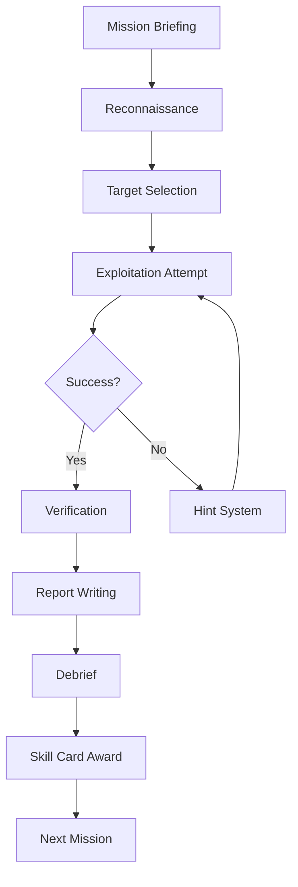

# BountyWarz Learning Loop PRD
## Product Requirements Document: Gameplay & Progression

**PRD ID:** BOUNTYWARZ-LEARNING-PRD-v1.0  
**Version:** 1.0.0  
**Last Updated:** August 5, 2026  
**Status:** DRAFT - Ready for Review  
**Owner:** Game Design Lead  
**Priority:** P0 (Core Gameplay)  
**Target Launch:** Phase 1 (Weeks 1-4)  

---

## 🎯 Executive Summary

The BountyWarz Learning Loop is the **core gameplay system** that teaches cybersecurity concepts through immersive missions, adaptive challenges, and certification-aligned progression. It uses London history as a pedagogical scaffold and skill cards as learning artifacts.

> **BountyWarz teaches cybersecurity through story-driven missions that map real vulnerability classes to historical London events, with certification-aligned skill cards tracking player progress.**

---

## 📚 Related Documents

This PRD is part of the complete [Athelgard PRD Set](canvas). Related documents:
- [Athelgard Core PRD](canvas) - Core system requirements
- [Athelgard Ethical Blueprint](canvas) - Ethical framework
- [BountyWarz Product Memo](canvas) - Philosophy and priorities
- [BountyWarz UX Upgrades](canvas) - Implementation guide

---

## 🎯 Goals & Objectives

### Primary Goals
1. **Engaging Education** - Teach real cybersecurity skills through gameplay
2. **Adaptive Difficulty** - Match challenges to player skill level
3. **Ethical Foundation** - Reinforce responsible disclosure at every step
4. **Progression Path** - Guide players from simulation to authorized participation
5. **Certification Alignment** - Map learning to real industry certifications

### Success Criteria
- [ ] Players learn real, applicable cybersecurity skills
- [ ] Players understand ethical boundaries
- [ ] Players progress at their own pace
- [ ] Players can articulate what they've learned
- [ ] Players are prepared for real-world participation

---

## 👥 User Stories

### As a New Player
- I want to start playing immediately without signup
- I want to learn cybersecurity concepts through engaging missions
- I want to understand the ethical boundaries of what I'm doing

### As a Returning Player
- I want to continue my progress from where I left off
- I want to see my skill cards and achievements
- I want to tackle more challenging missions

### As a Serious Learner
- I want to map my progress to real certifications
- I want to practice in safe, controlled environments
- I want to prepare for authorized bug bounty programs

---

## 🏗️ Technical Requirements

### Core Game Systems

#### 1. Mission System
**Purpose:** Deliver cybersecurity learning through immersive gameplay

**Requirements:**
- [ ] **Mission Types**
  - Drone recon missions
  - Hack/breach challenges
  - Quiz loops
  - Story-driven investigations

- [ ] **Mission Structure**
  - Clear objectives
  - Progressive difficulty
  - Adaptive branching
  - Ethical framing

- [ ] **Mission Flow**
  ```
  Briefing → Reconnaissance → Exploitation → Verification → Reporting → Debrief
  ```

- [ ] **Adaptive Difficulty**
  - Assess player skill level
  - Adjust mission complexity
  - Provide appropriate hints
  - Track progress

#### 2. London History Scaffold (Rob's Pedagogical Framework)
**Purpose:** Use historical London events as teaching framework

**Requirements:**
- [ ] **Era Mappings**
  | Era | Historical Event | Cybersecurity Concept | Bug Class | Threat Model | Remediation | Cert Skill | Mission Card |
  |-----|------------------|----------------------|-----------|--------------|-------------|------------|--------------|
  | 1666 | Great Fire of London | Cascading failure, containment | Buffer overflow, memory corruption | Uncontrolled propagation | Segmentation, isolation | Risk Management | Firebreak Protocol |
  | 1940s | The Blitz | Resilience, redundancy, deception | DDoS, availability attacks | Resource exhaustion | Redundancy, failover | Business Continuity | Blitz Defense |
  | Victorian | Sewer/Infrastructure | Legacy systems, hidden dependencies | Supply chain, third-party risk | Compromised dependencies | Maintenance, updates | Supply Chain Security | Victorian Maintenance |
  | Cold War | Telecom/espionage | Network trust, interception | MITM, eavesdropping | Compromised communication | Encryption, authentication | Network Security | Cold War Comms |
  | Modern | Financial London | Fraud, access control | Authentication bypass | Unauthorized access | Auditability, logging | Access Control | Financial Gateway |

- [ ] **Historical Integration**
  - Each era has dedicated missions
  - Historical context in mission briefings
  - Visual themes matching era
  - Narrative connections to cybersecurity

- [ ] **Pedagogical Effectiveness**
  - Players remember concepts through stories
  - Historical analogies reinforce learning
  - Context makes abstract concepts concrete

#### 3. Skill Card System
**Purpose:** Track progress and provide learning artifacts

**Requirements:**
- [ ] **Card Types**
  - Certification-aligned skill cards
  - Vulnerability class cards
  - Threat model cards
  - Remediation cards
  - Historical cards

- [ ] **Card Mechanics**
  - Earned through mission completion
  - Represent mastery of concepts
  - Mapped to certification pathways
  - Portfolio evidence

- [ ] **Card Properties**
  - Title
  - Description
  - Related concepts
  - Certification alignment
  - Prerequisites
  - Difficulty level

- [ ] **Card Display**
  - Visual representation
  - Progress tracking
  - Collection view
  - Sharing capabilities (non-credential)

#### 4. Progression System
**Purpose:** Guide players through learning tiers

**Requirements:**
- [ ] **Tier Structure**
  - **Tier 1: Simulated Learning** - Story-grounded simulation
  - **Tier 2: Controlled Practice** - Safe labs and sandbox
  - **Tier 3: Readiness Assessment** - Qualify for real-world
  - **Tier 4: Authorized Participation** - Real bug bounty prep

- [ ] **Tier Progression**
  - Clear gates between tiers
  - Readiness assessments
  - Prerequisite checks
  - Ethical validation

- [ ] **Progression Tracking**
  - Experience points
  - Level system
  - Achievement badges
  - Skill mastery indicators

#### 5. Captain/Guest System
**Purpose:** Manage player identity and progress

**Requirements:**
- [ ] **Guest Mode**
  - No signup required
  - Limited progress saving
  - Full gameplay access
  - Encouragement to create account

- [ ] **Captain Mode**
  - Full progress persistence
  - Skill card collection
  - Mission history
  - Preferences and settings

- [ ] **Conversion Flow**
  - Seamless transition from guest to captain
  - Progress preservation
  - Minimal friction
  - Clear value proposition

#### 6. Nation System
**Purpose:** Provide flavor and progression structure

**Requirements:**
- [ ] **Nation Selection**
  - Multiple nations to choose from
  - Each with unique themes
  - Different starting missions
  - Progression paths

- [ ] **Nation Benefits**
  - Unique mission types
  - Special skill cards
  - Thematic content
  - Visual customization

---

## 📊 Functional Specifications

### Mission Flow Diagram



### Learning Progression Model

```
┌─────────────────────────────────────────────────────────────────┐
│                    LEARNING PROGRESSION                           │
├─────────────────────────────────────────────────────────────────┤
│                                                                  │
│  Tier 1: Story-Grounded Simulation                                │
│  ├─ Drone recon missions                                         │
│  ├─ Narrative vulnerability cases                                 │
│  ├─ Hack/breach/quiz/card loops                                   │
│  ├─ Nation-based flavor and progression                           │
│  ├─ London history as instructional framing                       │
│  └─ Athelgard adaptation to player level                         │
│         ↓                                                           │
│  Tier 2: Controlled Practice                                      │
│  ├─ Safe labs (DVWA, OWASP Juice Shop)                             │
│  ├─ Sandbox targets                                                │
│  ├─ Intentionally vulnerable exercises                            │
│  ├─ Proof-of-concept reasoning                                     │
│  ├─ Remediation walkthroughs                                      │
│  └─ Reporting drills                                               │
│         ↓                                                           │
│  Tier 3: Readiness Assessment                                     │
│  ├─ Scope interpretation checks                                   │
│  ├─ Safe-harbor comprehension                                      │
│  ├─ Report-quality scoring                                        │
│  ├─ Judgment exercises                                             │
│  ├─ Data-minimization scenarios                                   │
│  └─ Ethical branching decisions                                   │
│         ↓                                                           │
│  Tier 4: Authorized Participation Support                         │
│  ├─ Program-rule reading guidance                                  │
│  ├─ Scope sanity-checking                                         │
│  ├─ Evidence organization                                          │
│  ├─ Severity reasoning                                             │
│  ├─ Report drafting                                                │
│  └─ Debriefing and reflection                                      │
│                                                                  │
└─────────────────────────────────────────────────────────────────┘
```

### Skill Card Data Model

```yaml
skill_card:
  id: string (unique identifier)
  title: string
  description: string
  type: enum[certification, vulnerability, threat, remediation, historical]
  certification_alignment:
    - name: string (e.g., "CompTIA Security+")
    - domain: string
    - objective: string
  related_concepts:
    - string
  prerequisites:
    - card_id: string
  difficulty: enum[easy, medium, hard, expert]
  era: string (London history era)
  mission_requirement: boolean
  image: string (visual representation)
  earned_date: datetime
  mastery_level: number (0-100)
```

### Mission Data Model

```yaml
mission:
  id: string
  title: string
  description: string
  era: string (London history era)
  tier: enum[1, 2, 3, 4]
  difficulty: enum[easy, medium, hard]
  estimated_duration: number (minutes)
  objectives:
    - description: string
    - required: boolean
  story:
    briefing: string
    narrative: string
    debrief: string
  targets:
    - id: string
      name: string
      type: enum[simulation, safe_lab, authorized]
      vulnerabilities:
        - cwe_id: string
          description: string
          severity: enum[low, medium, high, critical]
  hints:
    - level: enum[1, 2, 3]  # Progressive hints
      text: string
  rewards:
    experience: number
    skill_cards:
      - card_id: string
    currency: number
  prerequisites:
    - mission_id: string
    OR
    skill_card_id: string
```

---

## 📈 Non-Functional Requirements

### Performance
- Mission load time: <2 seconds
- Progression calculation: <100ms
- Skill card rendering: <500ms
- Adaptive difficulty adjustment: <200ms

### Scalability
- Support 100,000+ concurrent players
- Mission data caching
- Progression data indexing
- Efficient query patterns

### Content
- 50+ missions at launch
- 100+ skill cards at launch
- 5 London eras fully developed
- 4 nations with unique content

---

## 🎯 Success Metrics

### Engagement Metrics
- **First Mission Completion:** >80% of new players
- **Time to First Mission:** <5 seconds
- **Mission Completion Rate:** >70% per mission
- **Return Rate:** >60% of players return within 7 days

### Learning Metrics
- **Concept Retention:** >80% after 30 days
- **Skill Card Completion:** >70% of available cards
- **Tier Progression:** >50% advance from Tier 1 to Tier 2
- **Ethical Understanding:** >90% can explain safe harbor

### Progression Metrics
- **Guest→Captain Conversion:** >50%
- **Tier 3 Qualification:** >30% of Tier 2 completers
- **Tier 4 Participation:** >10% of Tier 3 completers
- **Certification Alignment:** >80% of users see value

---

## 🔗 Dependencies

### Internal Dependencies
- [Athelgard Core PRD](canvas) - Identity and safety layer
- [Athelgard Ethical Blueprint](canvas) - Ethical framework
- [BountyWarz Product Memo](canvas) - Philosophy

### External Dependencies
- Supabase - Player progression storage
- Content Management System - Mission and card content

---

## 📅 Timeline & Milestones

### Phase 1: Core Gameplay (Weeks 1-4)
- [ ] Mission System v1
- [ ] London History Scaffold v1
- [ ] Skill Card System v1
- [ ] Captain/Guest System v1
- [ ] Nation System v1
- [ ] Basic Progression

### Phase 2: Safe Labs (Weeks 5-8)
- [ ] Tier 2 missions
- [ ] DVWA integration
- [ ] OWASP Juice Shop integration
- [ ] Safe lab environment
- [ ] Readiness assessments

### Phase 3: Real-World Prep (Weeks 9-12)
- [ ] Tier 3 qualification
- [ ] Authorized program workflows
- [ ] Report writing tools
- [ ] Portfolio system

---

## ❓ Open Questions

1. **Mission Authoring:** Should we build a mission authoring tool?
2. **Content Updates:** How often should we add new missions?
3. **Difficulty Balancing:** How do we ensure consistent difficulty across missions?
4. **Certification Mapping:** Which certifications should we align with first?

---

## ✅ Approval

This PRD synthesizes contributions from:
- Rob CranmerBrown/Kiran Wolfe (UX vision, ethical framework, London scaffold)
- Devins (System architecture)
- Meli (Prompt engineering)
- Kimiclaw (Domain modeling)
- Nyx-grok (Service specs)
- Nyx-ninja (Discipline and contracts)

---

*Part of the [Athelgard PRD Set](canvas). See the full set for all product requirements.*