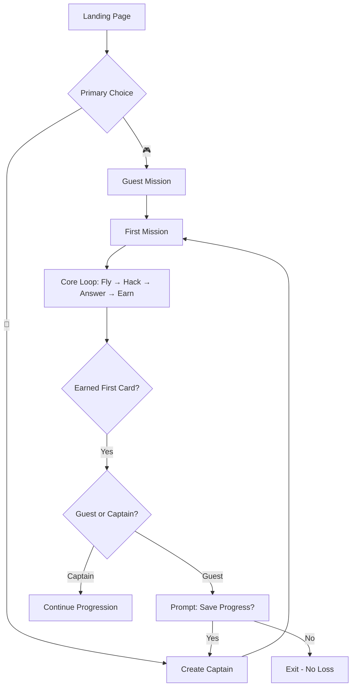

# BountyWarz Product Memo
## Core Philosophy: Fly First, Explain Second

**Date:** August 5, 2026  
**Author:** UX Synthesis  
**Status:** Active  
**Priority:** P0 - Core Experience

---

## 🎯 The Problem (One Sentence)

> The product is selling instant browser gameplay while presenting account recovery mechanics too early.

---

## 📋 Executive Summary

BountyWarz has a **strong core product**: browser-native drone recon gameplay with real CVE challenges and certification-aligned skill cards. The gameplay loop (fly → hack → answer → earn) is compelling and unique.

However, the **entry funnel is broken**. New users encounter account recovery mechanics before experiencing the game's value. This creates friction, confusion, and trust issues that prevent conversion.

**The Solution:** Let people fly first. Explain identity second.

---

## 🚨 Current State: What's Broken

### Critical Trust Killers

| Issue | Impact | Severity |
|-------|--------|----------|
| Pre-visible "Invalid captain name or recovery key!" | Creates immediate distrust | **P0** |
| Login form above the fold | Confuses new users | **P0** |
| "Recovery key" terminology before explanation | Sounds like advanced admin | **P0** |

### Flow Fractures

| Issue | Current | Ideal |
|-------|---------|-------|
| Primary CTA | Mixed messages | Single clear action |
| Guest access | Unclear | Explicit "Play as Guest" |
| Account creation | Required upfront | Deferred until value felt |
| First mission | Multiple clicks away | One click |

### The Emotional Journey (Current)

```
User arrives → "Free browser game!" ✓
             → "Fly your first mission!" ✓
             → Sees login form with ERROR ✗
             → "Captain name?" ✗
             → "Recovery key?" ✗
             → "Something's broken" ✗
             → BOUNCE
```

---

## ✅ Desired State: Smooth Gameplay, No Clutter

### The Emotional Journey (Ideal)

```
User arrives → "Free browser game!" ✓
             → "Play First Mission" ✓
             → In game within 3 seconds ✓
             → Experiences core loop ✓
             → "This is cool!" ✓
             → "Save my progress?" ✓
             → Creates captain ✓
             → Continues playing ✓
```

### Core Principle

> **Defer friction until after the first win.**

Every element on the homepage should answer one question: "What do I click to try this?"

---

## 🎯 The Funnel (Simplified)



### Key Funnel Metrics (Targets)

| Metric | Current (Est.) | Target | Improvement |
|--------|----------------|--------|-------------|
| Time to first click | 10-15 sec | <3 sec | 75% faster |
| Time to first mission | 30-60 sec | <5 sec | 90% faster |
| Guest-to-captain conversion | Low | 30-40% | 3-4x increase |
| Bounce rate | High | <40% | Significant drop |

---

## 🏗️ Homepage Structure (New)

### Above the Fold (Hero Section)

```
┌─────────────────────────────────────────────────────────┐
│  BOUNTYWARZ                                              🦉 │
│                                                           │
│  Fly recon drones over real London.                      │
│  Breach live targets. Earn certification skills.        │
│                                                           │
│  ┌─────────────────────┐  ┌─────────────────────┐   │
│  │  🎮 PLAY FIRST MISSION │  │  👤 CREATE CAPTAIN   │   │
│  │     (Guest - No Signup)│  │   (Save Progress)    │   │
│  └─────────────────────┘  └─────────────────────┘   │
│                                                           │
│  Free · Browser-native · No install · No crypto           │
└─────────────────────────────────────────────────────────┘
```

### Secondary Section (How It Works)

```
┌─────────────────────────────────────────────────────────┐
│  HOW IT WORKS                                             │
│                                                           │
│  Guest Mode: Instant trial, no saved progress               │
│  Captain Mode: Keeps nation, cards, and progression         │
│  Recovery Key: Only needed to restore your captain later   │
└─────────────────────────────────────────────────────────┘
```

### Below the Fold (Everything Else)

- Nations
- Skill cards
- Lore
- Athelgard mentor explanation
- Login for returning players

---

## 📝 Copy Changes (Exact)

### Homepage Hero

**Before:**
```
Hi — I'm Athelgard, your mentor and guide here. In BountyWarz you fly recon drones over a real map of London and build genuine cybersecurity skills as you go. Give me a minute to ask a few quick questions, and I'll set everything up around what you want to learn.

Skip the talk — fly now →
```

**After:**
```
Fly recon drones over real London.
Breach live targets. Earn certification skills.

[🎮 PLAY FIRST MISSION] [👤 CREATE CAPTAIN]

Free · Browser-native · No install · No crypto
```

### Login Section

**Before:**
```
CAPTAIN LOGIN

Enter your captain name and recovery key

[Captain Name] [Recovery Key] [Login]

Invalid captain name or recovery key!

New Captain? Create account →
```

**After:**
```
RETURN TO YOUR CAPTAIN

Continue your hunt with your existing identity

[Username] [Password]

[Login]

New to BountyWarz? [Play as Guest] or [Create Captain]
```

### Captain Creation

**Before:**
```
ACCESS GRANTED

⚠ SAVE YOUR RECOVERY KEY

This is your only way to log back in. Screenshot it, copy it, or write it down now.
```

**After:**
```
WELCOME, CAPTAIN

🔑 Your Captain Key

Save this to return to your identity on any device:

[BRAVO42]

[Copy to Clipboard] [I've Saved It]

You'll earn skill cards as you play. These represent real cybersecurity knowledge!
```

### Recovery Key Explanation

**Before:** None (or unclear)

**After:**
```
Your captain key saves access to this identity.
Think of it like a portable backup code.
You only need it to return to your captain on another device.

If you lose it, you cannot recover your progress.
```

---

## 🎨 UI Components (New)

### 1. Primary CTA Buttons

```css
/* Primary: Play First Mission */
.cta-primary {
  background: linear-gradient(135deg, #00ff88, #00cc6a);
  color: #000;
  font-weight: 700;
  padding: 18px 40px;
  border-radius: 12px;
  font-size: 1.2rem;
  box-shadow: 0 0 30px rgba(0, 255, 136, 0.3);
  transition: all 0.3s ease;
}

.cta-primary:hover {
  transform: translateY(-3px);
  box-shadow: 0 10px 40px rgba(0, 255, 136, 0.5);
}

/* Secondary: Create Captain */
.cta-secondary {
  background: transparent;
  color: #00ff88;
  border: 2px solid #00ff88;
  /* same padding, radius, font as primary */
}

.cta-secondary:hover {
  background: rgba(0, 255, 136, 0.1);
}
```

### 2. Guest Mission Modal

```html
<div class="modal" id="guestModal">
  <h2>Ready to Fly?</h2>
  <p>Start a guest mission to try the game immediately.</p>
  <p class="muted">Your progress won't be saved, but you'll experience the full gameplay.</p>
  
  <button class="primary" onclick="startGuestMission()">
    Start Guest Mission
  </button>
  
  <button class="secondary" onclick="showCaptainCreation()">
    Create Captain to Save Progress
  </button>
</div>
```

### 3. Post-Mission Save Prompt

```html
<div class="modal" id="savePrompt">
  <h2>🎉 Mission Complete!</h2>
  <p>You earned: [Skill Card Name]</p>
  
  <div class="card-preview">
    <!-- Visual representation of earned card -->
  </div>
  
  <p>Create a captain to save your progress and continue your hunt!</p>
  
  <button class="primary" onclick="createCaptain()">
    Create Captain (2 min)
  </button>
  
  <button class="secondary" onclick="continueAsGuest()">
    Continue as Guest
  </button>
</div>
```

---

## 📊 Implementation Priority

### Week 1: Critical Fixes (P0)

| # | Task | Impact | Effort | Owner |
|---|------|--------|--------|-------|
| 1 | Remove pre-visible error message | Immediate trust repair | 5 min | Dev |
| 2 | Separate guest play from captain login | Removes first-session confusion | 2 hrs | Dev |
| 3 | Move login below primary CTAs | Keeps first screen action-oriented | 1 hr | Dev |
| 4 | Deploy demo page | Enables frictionless trial | 2 hrs | Dev |

### Week 2: Clarity Improvements (P1)

| # | Task | Impact | Effort | Owner |
|---|------|--------|--------|-------|
| 5 | Explain recovery key in one sentence | Reduces auth fear | 30 min | Copy |
| 6 | Make first mission one click | Aligns with promise | 1 hr | Dev |
| 7 | Add "save progress after mission" prompt | Defers friction | 1 hr | Dev |
| 8 | Clarify guest vs captain paths | Prevents ambiguity | 30 min | Copy |

### Week 3: Polish (P2)

| # | Task | Impact | Effort | Owner |
|---|------|--------|--------|-------|
| 9 | Add tooltips for unclear terms | Improves comprehension | 1 hr | Dev |
| 10 | Rename "recovery key" to "captain key" | Better terminology | 30 min | Copy |
| 11 | Add progress indicators | Improves UX | 1 hr | Dev |
| 12 | A/B test CTAs | Optimize conversion | 2 hrs | Growth |

---

## 🎯 Success Metrics

### Quantitative

- **Time to first mission:** <5 seconds (from landing)
- **Guest-to-captain conversion:** 30-40%
- **Bounce rate:** <40%
- **First mission completion rate:** >60%
- **Session duration:** >3 minutes

### Qualitative

- Users can describe the core gameplay loop after first session
- Users understand the difference between guest and captain modes
- Users feel confident about the recovery key system
- No users report confusion about what to click first

---

## 💡 Key Insights

### 1. The Recovery Key Problem

The current "recovery key" terminology is problematic because:
- Sounds like a backup mechanism, not primary login
- Users expect email/password/OAuth
- "Recovery" implies something went wrong
- Not intuitive that it's the *only* way to log in

**Solution:** Rename to "Captain Key" and explain upfront:
> "Your captain key is your password. Save it to return on any device."

### 2. The Athelgard Dilemma

Athelgard is a great character, but:
- Introducing a mentor before the game creates friction
- Users want to play, not be taught
- The mentor can appear *after* the first win to guide progression

**Solution:** Move Athelgard to post-first-mission onboarding.

### 3. The Lore Trap

The 18 nations, factions, and backstory are compelling, but:
- New users don't care about lore before playing
- It adds cognitive load to the entry funnel
- It can be discovered gradually during gameplay

**Solution:** Move all lore below the fold or into the game itself.

---

## 🚀 Launch Checklist

- [ ] Pre-visible error message removed from homepage
- [ ] Login form moved below primary CTAs
- [ ] "Play First Mission" button added and functional
- [ ] Demo/guest mission page deployed
- [ ] Captain creation flow simplified
- [ ] Recovery key explanation added
- [ ] Post-mission save prompt implemented
- [ ] Copy updates deployed
- [ ] Mobile responsiveness verified
- [ ] Cross-browser testing complete

---

## 📞 Support & Questions

**For implementation questions:** See the technical canvases
- [BountyWarz UX Upgrades - Implementation Guide](canvas)
- [BountyWarz Demo Page - Ready to Use](canvas)
- [BountyWarz Homepage Fix - Quick Implementation](canvas)

**For design decisions:** Refer to this memo

**For urgent issues:** Contact the UX team

---

## 🏆 The North Star

> **Let people fly first. Explain identity second.**

Every decision should be measured against this principle. If it adds friction before the first win, reconsider it. If it helps users experience the core gameplay faster, prioritize it.

The goal is **smooth gameplay with no clutter**—a seamless, frictionless path from curiosity to first win.