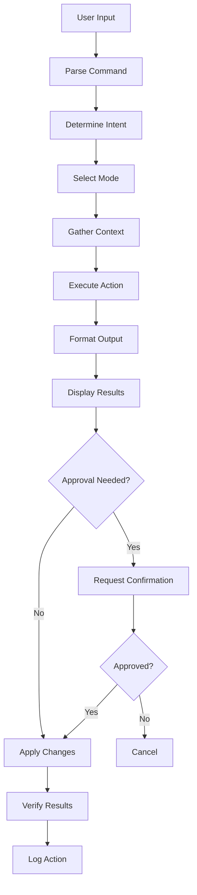

# CLI Product Spec PRD
## Product Requirements Document: Athelgard CLI

**PRD ID:** ATHELGARD-CLI-PRD-v1.0  
**Version:** 1.0.0  
**Last Updated:** August 5, 2026  
**Status:** DRAFT - Ready for Review  
**Owner:** CLI Engineering Lead  
**Priority:** P0 (Phase 1)  
**Target Launch:** Phase 1 (Weeks 1-4)  

---

## 🎯 Executive Summary

The Athelgard CLI is a **desktop command-line interface** that provides repo-aware coding assistance for BountyWarz development. It enables developers to inspect, analyze, and modify the codebase with Athelgard's guidance, understanding both the code and the game systems.

> **Athelgard CLI is a powerful yet friendly command-line tool that helps developers build BountyWarz with the same intelligence that guides players in the game.**

---

## 📚 Related Documents

This PRD is part of the complete [Athelgard PRD Set](canvas). Related documents:
- [Athelgard Core PRD](canvas) - Core system requirements
- [Athelgard System Architecture](canvas) - Four-layer model
- [Athelgard CLI Interface](canvas) - Developer interaction design
- [Athelgard Builder Mode](canvas) - Coding agent behavior

---

## 🎯 Goals & Objectives

### Primary Goals
1. **Repo-Aware Assistance** - Understand and navigate the BountyWarz codebase
2. **Builder Mode Integration** - Provide coding agent capabilities
3. **Service Integration** - Connect to GitHub, Supabase, Vercel
4. **Ethical Enforcement** - Apply safety guardrails to code changes
5. **Product Context** - Maintain awareness of game systems and learning design

### Success Criteria
- [ ] Developers can get help with any BountyWarz development task
- [ ] CLI understands the codebase structure and relationships
- [ ] Code changes align with learning design and ethical boundaries
- [ ] Service integrations work seamlessly
- [ ] CLI is fast, reliable, and easy to use

---

## 👥 User Stories

### As a BountyWarz Developer
- I want to scan the repo to understand its structure
- I want to get help fixing a bug
- I want to understand how a subsystem works
- I want to verify my changes before committing

### As a New Contributor
- I want to get up to speed on the codebase quickly
- I want to understand the development workflow
- I want to make safe, appropriate changes

### As a Maintainer
- I want to audit the codebase for issues
- I want to trace data flows
- I want to propose migrations safely

---

## 🏗️ Technical Requirements

### Core CLI Components

#### 1. Command Structure
**Purpose:** Provide intuitive, powerful commands

**Requirements:**
- [ ] **Core Commands**
  ```bash
  athelgard scan                    # Full repo analysis
  athelgard map                     # Map systems
  athelgard audit <surface>         # Audit flow
  athelgard trace <system>          # Trace data flow
  athelgard patch <task>           # Apply fix
  athelgard verify                  # Verify changes
  athelgard summarize               # Summarize
  ```

- [ ] **Connected-System Commands**
  ```bash
  athelgard inspect github          # GitHub inspection
  athelgard inspect captain-flow    # Captain flow
  athelgard inspect persistence     # Persistence
  athelgard inspect skill-cards     # Skill cards
  athelgard propose migration       # Propose migration
  athelgard branch <name>           # Create branch
  athelgard open pr                  # Open PR
  ```

- [ ] **Command Design Principles**
  - Conversational input (natural language arguments)
  - Structured output (formatted, actionable)
  - Safe default behavior (read-first, plan-before-patch)
  - Plan before patch
  - Verify before claim
  - Keep product context visible

#### 2. Repo Understanding (Nyx-grok's Contribution)
**Purpose:** Deep understanding of BountyWarz codebase

**Requirements:**
- [ ] **Repo Boot Scan** (Devins' Contribution)
  - Automatic project mapping
  - Subsystem identification
  - Dependency analysis
  - File relationship graph

- [ ] **Code Analysis**
  - Static code analysis
  - Pattern recognition
  - Anti-pattern detection
  - Best practice suggestions

- [ ] **System Mapping**
  - Architectural diagrams
  - Data flow visualization
  - Component relationships
  - Integration points

#### 3. Builder Mode Integration (Nyx-ninja's Contribution)
**Purpose:** Provide coding agent capabilities

**Requirements:**
- [ ] **Builder Mode Contract**
  - Situation → Impacted Systems → Plan → Patch → Verify → Risks
  
- [ ] **Code Generation**
  - Context-aware code suggestions
  - Pattern-based generation
  - Style-consistent output
  - Test case generation

- [ ] **Patch Application**
  - Safe code modifications
  - Change verification
  - Rollback capability
  - Conflict resolution

- [ ] **Verification**
  - Automated testing
  - Manual verification steps
  - Impact analysis
  - Risk assessment

#### 4. Service Integrations
**Purpose:** Connect to external services for development

**Requirements:**
- [ ] **GitHub Integration** (Nyx-grok's Spec)
  - Repository access
  - Issue and PR management
  - Branch operations
  - Commit analysis
  - War room for world changes

- [ ] **Supabase Integration** (Nyx-grok's Spec)
  - Schema inspection
  - Data flow tracing
  - Migration proposals
  - Query analysis
  - World's memory substrate

- [ ] **Vercel Integration**
  - Preview management
  - Production deployments
  - Log inspection
  - Build analysis

#### 5. CLI-Specific Safety
**Purpose:** Enforce ethical boundaries in CLI operations

**Requirements:**
- [ ] **Read-First Principle**
  - Always analyze before modifying
  - Require explicit approval for mutations
  - Provide impact analysis

- [ ] **Scope Enforcement**
  - Only modify BountyWarz repo by default
  - Require explicit confirmation for external changes
  - Block unauthorized modifications

- [ ] **Ethical Validation**
  - Check all changes against ethical guidelines
  - Validate learning design alignment
  - Ensure trust and safety

---

## 📊 Functional Specifications

### Command Flow Diagram



### Command Specifications

#### Scan Command
```yaml
command: athelgard scan
purpose: Full repo analysis
actions:
  - Map all files and directories
  - Identify subsystems
  - Analyze dependencies
  - Detect patterns and anti-patterns
  - Generate system overview
output:
  format: Structured report
  sections:
    - Repository structure
    - Subsystem map
    - Dependency graph
    - Issues and recommendations
    - Next steps
```

#### Map Command
```yaml
command: athelgard map
purpose: Map systems
arguments:
  - optional: subsystem name
  - optional: depth level
actions:
  - Visualize system architecture
  - Show component relationships
  - Trace data flows
  - Identify integration points
output:
  format: ASCII diagram or Mermaid
  includes:
    - Components
    - Connections
    - Data flows
    - External dependencies
```

#### Audit Command
```yaml
command: athelgard audit <surface>
purpose: Audit flow
arguments:
  surface: enum[captain-flow, guest-flow, mission, skill-cards, onboarding]
actions:
  - Analyze specified surface
  - Identify trust breaks
  - Check ethical framing
  - Validate learning outcomes
  - Generate audit report
output:
  format: Structured audit report
  sections:
    - Current state
    - Issues found
    - Ethical concerns
    - Recommendations
    - Priority ranking
```

#### Trace Command
```yaml
command: athelgard trace <system>
purpose: Trace data flow
arguments:
  system: string (system or component name)
actions:
  - Identify data entry points
  - Trace through all transformations
  - Map storage locations
  - Identify exit points
  - Analyze for vulnerabilities
output:
  format: Data flow diagram
  includes:
    - Entry points
    - Transformations
    - Storage
    - Exit points
    - Potential issues
```

#### Patch Command
```yaml
command: athelgard patch <task>
purpose: Apply fix
arguments:
  task: string (description of fix needed)
actions:
  - Analyze problem
  - Identify impacted systems
  - Generate fix plan
  - Create patch
  - Verify changes
  - Assess risks
output:
  format: Patch proposal
  sections:
    - Problem analysis
    - Impacted systems
    - Fix plan
    - Patch code
    - Verification steps
    - Risk assessment
```

### Builder Mode Contract

```
Input: User request (natural language)

Process:
1. Situation Analysis
   - Understand the problem
   - Identify context
   - Assess urgency

2. Impacted Systems Identification
   - Map affected components
   - Trace dependencies
   - Identify integration points

3. Plan Generation
   - Develop solution approach
   - Break into steps
   - Identify risks
   - Estimate effort

4. Patch Creation
   - Write code changes
   - Include tests
   - Add documentation
   - Update comments

5. Verification
   - Automated tests
   - Manual verification
   - Impact assessment
   - Risk evaluation

6. Risk Assessment
   - Identify potential issues
   - Mitigation strategies
   - Rollback plan
   - Monitoring needs

Output: Structured response with all sections
```

### Service Integration Specifications

#### GitHub Integration
```yaml
integration: github
capabilities:
  - Repository access (read/write)
  - Issue management
  - Pull request workflows
  - Branch operations
  - Commit analysis
  - Webhook handling
safety:
  - Explicit approvals for mutations
  - Product-aware PR templates
  - Rollback capability
  - Migration safety checks
```

#### Supabase Integration
```yaml
integration: supabase
capabilities:
  - Schema inspection
  - Data flow tracing
  - Query analysis
  - Migration proposals
  - Performance monitoring
safety:
  - Read-first approach
  - Explicit approvals for changes
  - Data exposure prevention
  - Backup verification
```

---

## 📈 Non-Functional Requirements

### Performance
- Command execution: <2 seconds for 95% of commands
- Repo scan: <10 seconds
- Code analysis: <5 seconds per file
- Service integration: <1 second response time

### Reliability
- 99.9% command success rate
- Graceful error handling
- Automatic retry for transient failures
- Comprehensive logging

### Usability
- Intuitive command structure
- Helpful error messages
- Context-sensitive help
- Tab completion
- History and recall

### Security
- No storage of sensitive credentials
- Encrypted communication with services
- Input validation
- Rate limiting

---

## 🎯 Success Metrics

### Adoption Metrics
- **CLI Adoption:** >70% of development tasks use Athelgard CLI
- **Daily Active Users:** >20 developers
- **Command Usage:** >100 commands/day

### Effectiveness Metrics
- **Code Quality:** >20% reduction in onboarding-related bugs
- **Development Velocity:** >15% faster feature implementation
- **Ethical Compliance:** 100% of changes pass ethical review
- **Bug Fix Time:** <30 minutes average for CLI-assisted fixes

### User Metrics
- **User Satisfaction:** >4.5/5
- **Command Success Rate:** >95%
- **Feature Requests:** Track and prioritize

---

## 🔗 Dependencies

### Internal Dependencies
- [Athelgard Core PRD](canvas) - Identity, modes, safety
- [Athelgard System Architecture](canvas) - Four-layer model
- [Athelgard CLI Interface](canvas) - Developer interaction design

### External Dependencies
- GitHub API - Repository access
- Supabase API - Database access
- Vercel API - Deployment access
- Node.js - Runtime environment

---

## 📅 Timeline & Milestones

### Phase 1: Core CLI (Weeks 1-4)
- [ ] Command parser
- [ ] Repo boot scan
- [ ] Basic commands (scan, map, summarize)
- [ ] Builder mode integration
- [ ] Local testing

### Phase 2: Service Integrations (Weeks 5-8)
- [ ] GitHub integration
- [ ] Supabase integration
- [ ] Vercel integration
- [ ] Advanced commands (audit, trace, patch)
- [ ] Safety layer integration

### Phase 3: Refinement (Weeks 9-12)
- [ ] Performance optimization
- [ ] Usability improvements
- [ ] Advanced features
- [ ] Documentation

---

## ❓ Open Questions

1. **Installation:** Should we support npm, Homebrew, or both?
2. **Authentication:** How should CLI authenticate with services?
3. **Offline Mode:** Should CLI work offline with cached data?
4. **Plugin System:** Should we support plugins for extensibility?
5. **Team Features:** Should we add team collaboration features?

---

## ✅ Approval

This PRD synthesizes contributions from:
- Rob CranmerBrown/Kiran Wolfe (Ethical framework, phone guidance)
- Devins (Repo boot scan, architecture)
- Meli (Prompt engineering)
- Kimiclaw (Domain modeling)
- Nyx-grok (GitHub/Supabase behavior specs)
- Nyx-ninja (Builder mode contracts, discipline)

---

*Part of the [Athelgard PRD Set](canvas). See the full set for all product requirements.*