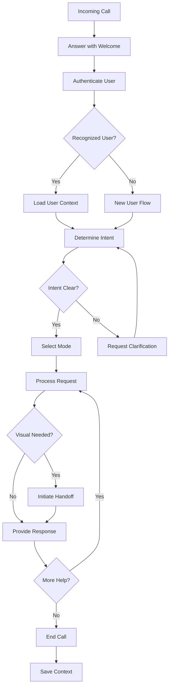

# Voice Product Spec PRD
## Product Requirements Document: Athelgard Voice

**PRD ID:** ATHELGARD-VOICE-PRD-v1.0  
**Version:** 1.0.0  
**Last Updated:** August 5, 2026  
**Status:** DRAFT - Ready for Review  
**Owner:** Voice Engineering Lead  
**Priority:** P0 (Phase 3)  
**Target Launch:** Phase 3 (Weeks 9-12)  

---

## 🎯 Executive Summary

Athelgard Voice provides **phone-accessible mentorship** for cybersecurity learning and ethical bounty hunting. It enables users to call Athelgard for guidance, explanation, and coaching, with intelligent handoff to visual interfaces when needed.

> **Athelgard Voice is a phone-based coaching system that provides real-time mentorship, ethical triage, and mission guidance, with seamless handoff to web/mobile for visual or code-heavy tasks.**

---

## 📚 Related Documents

This PRD is part of the complete [Athelgard PRD Set](canvas). Related documents:
- [Athelgard Core PRD](canvas) - Core system requirements
- [Athelgard Ethical Blueprint](canvas) - Ethical framework
- [Athelgard Founder Memo](canvas) - Phone behavior specification

---

## 🎯 Goals & Objectives

### Primary Goals
1. **Accessible Mentorship** - Provide coaching via phone for users who prefer voice
2. **Real-Time Guidance** - Offer immediate help for mission and ethical questions
3. **Intelligent Handoff** - Seamlessly transition to visual interfaces when appropriate
4. **Context Continuity** - Maintain conversation state across calls
5. **Ethical Enforcement** - Apply safety guardrails in all voice interactions

### Success Criteria
- [ ] Users can get help via phone for any Athelgard function
- [ ] Voice interactions feel natural and helpful
- [ ] Handoff to visual interfaces is smooth and appropriate
- [ ] Context is preserved across multiple calls
- [ ] Ethical boundaries are never crossed

---

## 👥 User Stories

### As a Player on the Go
- I want to call Athelgard when I'm stuck on a mission
- I want to get mission briefings via phone
- I want to ask conceptual questions about cybersecurity

### As a Developer
- I want to get quick answers about code changes
- I want to understand system architecture via voice
- I want to get ethical guidance on scope questions

### As a Learner
- I want coaching on responsible disclosure
- I want help understanding vulnerability classes
- I want encouragement and motivation

---

## 🏗️ Technical Requirements

### Core Voice Components

#### 1. Phone Infrastructure
**Purpose:** Handle inbound and outbound phone calls

**Requirements:**
- [ ] **Phone Number**
  - Dedicated number: 949-470-2082 (as specified)
  - Twilio platform integration
  - Call routing and management

- [ ] **Call Handling**
  - Inbound call reception
  - Outbound call capability (future)
  - Call queuing
  - Voicemail (fallback)

- [ ] **Speech Processing**
  - Speech-to-text transcription
  - Text-to-speech synthesis
  - Natural language understanding
  - Intent classification

- [ ] **Call Quality**
  - HD voice support
  - Noise suppression
  - Echo cancellation
  - Latency optimization

#### 2. Voice Modes (Rob's Phone Layer Design)
**Purpose:** Adapt Athelgard's behavior for voice interactions

**Requirements:**
- [ ] **Quick Help Mode**
  - Short answers to specific questions
  - Next-step guidance
  - Definition explanations
  - Fast response time

- [ ] **Mission Guide Mode**
  - In-game coaching
  - Mission walkthroughs
  - Hint provision
  - Progress tracking

- [ ] **Ethical Triage Mode**
  - Scope questions
  - Restraint guidance
  - Reporting advice
  - Safe harbor explanation

- [ ] **Builder Brief Mode**
  - Developer planning
  - System overview
  - Bug summarization
  - Architecture explanation

#### 3. Conversation System
**Purpose:** Manage voice interactions naturally

**Requirements:**
- [ ] **Dialog Management**
  - Context tracking
  - Turn-taking
  - Interruption handling
  - Clarification requests

- [ ] **Memory Integration**
  - Access to user history
  - Cross-call context
  - Learning progress
  - Preferences

- [ ] **Multi-Turn Conversations**
  - Follow-up questions
  - Contextual responses
  - Progressive disclosure
  - Summary capabilities

#### 4. Handoff System
**Purpose:** Transition to visual interfaces when needed

**Requirements:**
- [ ] **Handoff Detection**
  - Identify visual needs (diagrams, code, UI)
  - Identify code-heavy needs (long code snippets, diffs)
  - Identify operationally sensitive needs

- [ ] **Handoff Mechanisms**
  - SMS with link
  - Email with link
  - In-app notification
  - Direct app opening (deep link)

- [ ] **Handoff Phrases**
  - "Open the game to see this visual"
  - "Check the CLI for the detailed implementation"
  - "View the report template in the app"
  - "I'll send you a link to continue this conversation"

- [ ] **Context Transfer**
  - Pass conversation state to visual interface
  - Maintain continuity
  - Preserve intent

#### 5. Voice-Specific Safety
**Purpose:** Enforce ethical boundaries in voice interactions

**Requirements:**
- [ ] **Scope Validation**
  - Verify target authorization in voice requests
  - Block unauthorized target discussions
  - Require explicit confirmation for sensitive actions

- [ ] **Action Restrictions**
  - No step-by-step live offensive instructions
  - No guiding risky behavior on ambiguous targets
  - No helping bypass scope limits

- [ ] **Data Protection**
  - No discussion of real user data
  - Immediate halt if real data is mentioned
  - Sanitization of sensitive information

---

## 📊 Functional Specifications

### Call Flow Diagram



### Voice Mode Specifications

#### Quick Help Mode
```yaml
mode: quick_help
purpose: Short answers, next steps
use_cases:
  - "What does X mean?"
  - "What do I do next?"
  - "Explain Y"
  - "Define Z"
response_style: Concise, direct, helpful
time_target: <30 seconds per response
```

#### Mission Guide Mode
```yaml
mode: mission_guide
purpose: In-game coaching
use_cases:
  - "Walk me through the first target"
  - "I'm stuck on mission X"
  - "What's the objective?"
  - "Give me a hint"
response_style: Patient, encouraging, adaptive
time_target: 1-3 minutes per interaction
features:
  - Mission context awareness
  - Player progress tracking
  - Adaptive hint system
  - Ethical reinforcement
```

#### Ethical Triage Mode
```yaml
mode: ethical_triage
purpose: Scope, restraint, reporting
use_cases:
  - "Is this in scope?"
  - "I found sensitive data"
  - "Can I test this?"
  - "What are the rules?"
response_style: Deliberate, safety-focused, structured
time_target: 2-5 minutes per interaction
features:
  - Scope classification
  - Risk assessment
  - Safe harbor explanation
  - Reporting guidance
```

#### Builder Brief Mode
```yaml
mode: builder_brief
purpose: Developer planning
use_cases:
  - "Summarize this bug"
  - "What subsystem broke?"
  - "How do I fix X?"
  - "Explain the architecture"
response_style: Technical, precise, structured
time_target: 3-5 minutes per interaction
features:
  - Repo awareness
  - System understanding
  - Code analysis
  - Solution planning
```

### Handoff Decision Matrix

| Situation | Handoff Needed? | Reason | Handoff Method |
|-----------|-----------------|--------|----------------|
| Code review (>10 lines) | ✅ Yes | Visual formatting | Link to CLI/Web |
| Diagram explanation | ✅ Yes | Visual representation | Link to Web |
| UI issue | ✅ Yes | Visual context | Link to App |
| Complex data | ✅ Yes | Visual analysis | Link to Web |
| Short answer | ❌ No | Voice sufficient | Continue voice |
| Conceptual question | ❌ No | Voice sufficient | Continue voice |
| Ethical question | ❌ No | Voice sufficient | Continue voice |
| Mission briefing | ❌ No | Voice sufficient | Continue voice |

### Phone Number Specification

```yaml
phone:
  number: "+1-949-470-2082"
  platform: Twilio
  type: Toll-free or local
  capabilities:
    - Inbound calls
    - Outbound calls (future)
    - SMS (for handoff links)
    - Voicemail
  configuration:
    welcome_message: "Welcome to Athelgard. How can I help you today?"
    busy_message: "All agents are busy. Please leave a voicemail."
    after_hours_message: "Athelgard is currently unavailable. Please try again later."
    max_call_duration: 30 minutes
    recording: Optional (with consent)
```

---

## 📈 Non-Functional Requirements

### Performance
- Call answer time: <5 seconds
- Speech-to-text latency: <200ms
- Response generation: <1 second
- Handoff initiation: <2 seconds

### Reliability
- 99.9% call availability
- <1% call drop rate
- <5% speech recognition errors
- Graceful degradation on failures

### Scalability
- Support 100+ concurrent calls
- Scale to 1,000+ calls/day
- Efficient resource usage
- Geographic distribution

### Voice Quality
- HD voice support
- Background noise suppression
- Echo cancellation
- Multiple language support (future)

---

## 🎯 Success Metrics

### Call Metrics
- **Answer Rate:** >95% of calls answered
- **Call Completion Rate:** >90%
- **Average Call Duration:** 3-5 minutes
- **Wait Time:** <10 seconds average

### User Metrics
- **Voice User Satisfaction:** >4.5/5
- **Handoff Rate:** 30-40% (appropriate)
- **Return Call Rate:** >50% of users call again
- **Voice Session Completion:** >80%

### Business Metrics
- **Calls per Day:** >100 (Phase 3 target)
- **Voice User Retention:** >60% month-over-month
- **Voice-to-Visual Conversion:** >40%

---

## 🔗 Dependencies

### Internal Dependencies
- [Athelgard Core PRD](canvas) - Identity, memory, safety
- [Athelgard System Architecture](canvas) - Mode system

### External Dependencies
- Twilio - Phone platform
- Speech-to-Text API - Voice recognition
- Text-to-Speech API - Voice synthesis
- Phone number provider - 949-470-2082

---

## 📅 Timeline & Milestones

### Phase 1: Infrastructure (Weeks 1-4)
- [ ] Twilio integration
- [ ] Basic call handling
- [ ] Speech processing pipeline

### Phase 2: Core Voice (Weeks 5-8)
- [ ] Voice modes implementation
- [ ] Conversation system
- [ ] Basic handoff
- [ ] Internal testing

### Phase 3: Public Beta (Weeks 9-12)
- [ ] Public phone number activation
- [ ] User authentication
- [ ] Context persistence
- [ ] Advanced handoff
- [ ] Safety layer integration

### Phase 4: Scale (Weeks 13+)
- [ ] Performance optimization
- [ ] Advanced features (voicemail, callbacks)
- [ ] Multi-language support
- [ ] Analytics and monitoring

---

## ❓ Open Questions

1. **Phone Number:** Is 949-470-2082 confirmed as the final number?
2. **Twilio vs Alternatives:** Should we use Twilio or another platform?
3. **Call Recording:** Should we record calls for quality assurance?
4. **International Support:** Should we support international numbers?
5. **Cost Structure:** How will we handle call costs?

---

## ✅ Approval

This PRD synthesizes contributions from:
- Rob CranmerBrown/Kiran Wolfe (Phone layer design, handoff logic)
- Devins (Mode contracts)
- Meli (Voice rules)
- Kimiclaw (Safety constraints)
- Nyx-grok (Service integration)
- Nyx-ninja (Output contracts)

---

*Part of the [Athelgard PRD Set](canvas). See the full set for all product requirements.*